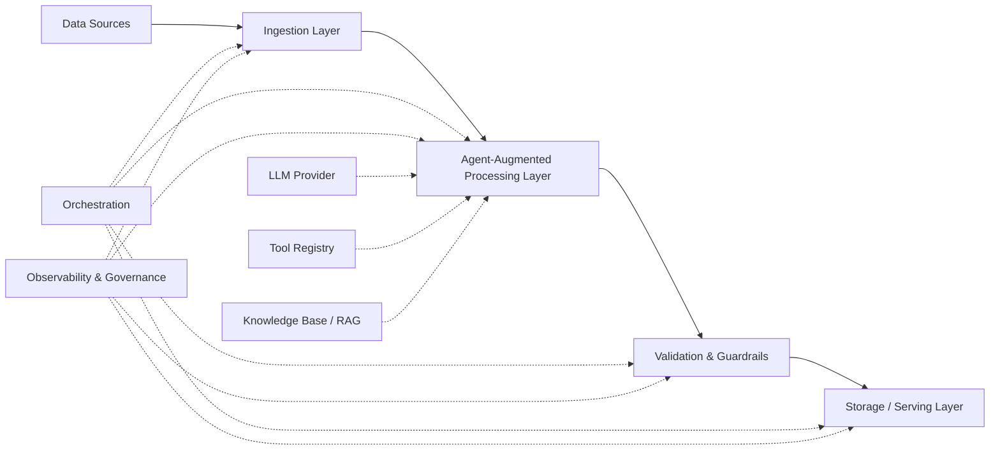
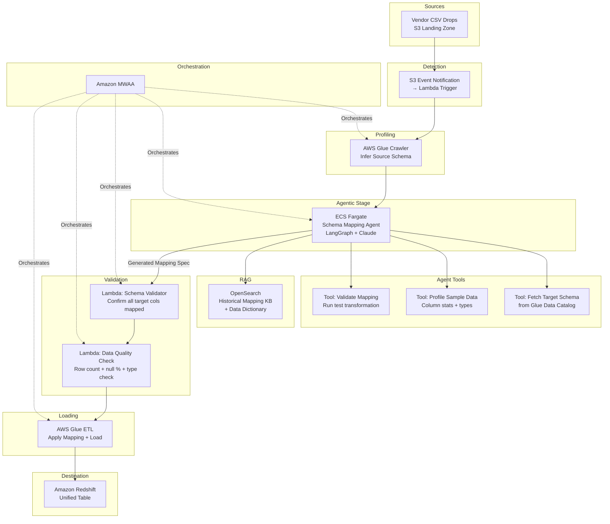
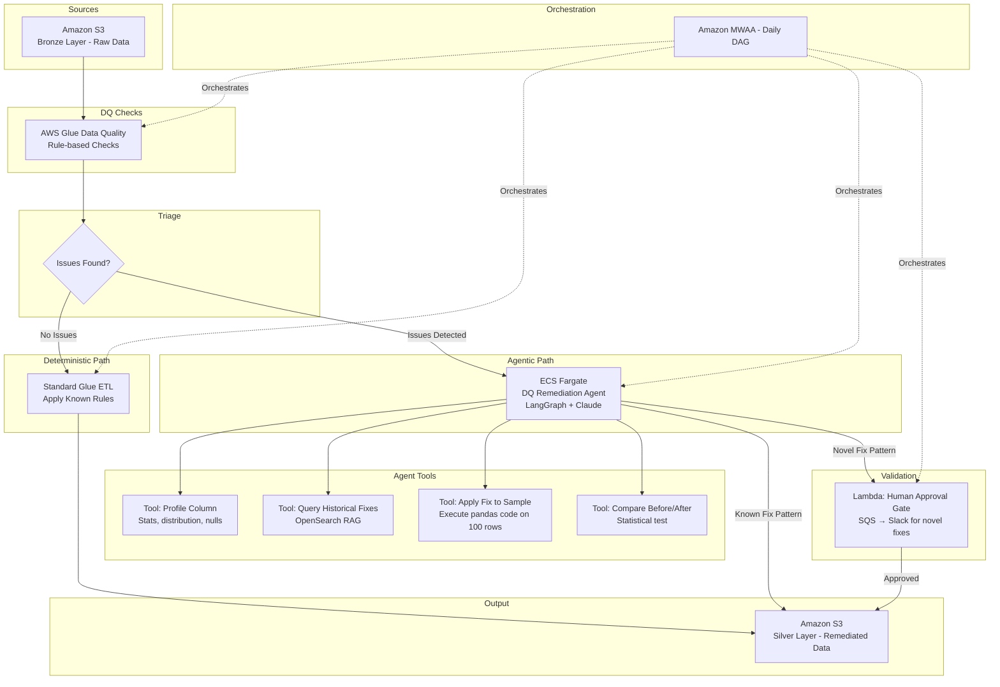
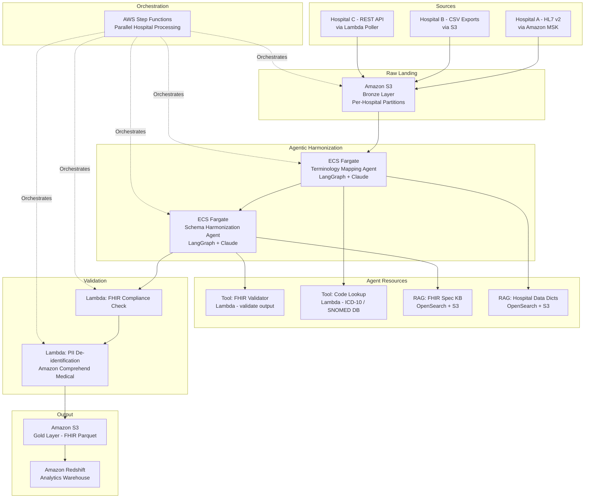

# System Design: Agentic Data Pipelines

## 1. Components

An agentic data pipeline is a data pipeline where one or more stages are driven by autonomous AI agents rather than purely deterministic code. Instead of rigidly coded transformation rules, an agent can dynamically decide *how* to clean data, *which* schema to apply, *what* anomalies to flag, or *how* to resolve data quality issues—adapting to novel data patterns at runtime. The core components of a production agentic data pipeline on AWS include:

| Component | AWS Services / Frameworks | Purpose |
|-----------|--------------------------|---------|
| **Ingestion** | Amazon Kinesis, AWS DMS, Amazon MSK, AWS Glue Crawlers | Captures raw data from sources (databases, APIs, streams, files). This layer remains deterministic. |
| **Agent-Augmented Processing** | ECS Fargate (LangGraph Agents), AWS Lambda, AWS Glue | The AI-driven core. Agents use LLMs and tools to dynamically decide transformation logic, resolve schema conflicts, classify data, or handle edge cases that rule-based systems cannot. |
| **LLM Provider** | Amazon Bedrock (Claude, Llama, Mistral) | Provides the reasoning engine for agents to analyze data samples, generate transformation code, or make classification decisions. |
| **Tool Registry** | AWS Lambda, MCP Servers on ECS | Callable functions the agent can invoke: execute SQL, run data quality checks, query a schema registry, call a geocoding API, etc. |
| **Knowledge Base / RAG** | Amazon Bedrock Knowledge Bases, Amazon OpenSearch Serverless | Provides agents with grounding context: data dictionaries, business rules, historical schema documentation, and transformation playbooks. |
| **Validation & Guardrails** | AWS Lambda, AWS Glue Data Quality, Bedrock Guardrails | Validates agent outputs before they are written to the storage layer. Catches hallucinated transformations, malformed schemas, or dangerous operations. |
| **Orchestration** | Amazon MWAA (Airflow), AWS Step Functions | Manages the end-to-end DAG, triggering deterministic and agentic stages in the correct order with retries and alerting. |
| **Storage** | Amazon S3 (Data Lake), Amazon Redshift, Amazon DynamoDB | Persists data at each stage: raw (Bronze), agent-processed (Silver), validated and aggregated (Gold). |
| **Observability** | Amazon CloudWatch, AWS X-Ray, LangSmith | Tracks both traditional pipeline metrics (rows processed, latency) and agent-specific telemetry (LLM tokens, reasoning traces, tool calls). |
| **Governance** | AWS Glue Data Catalog, AWS Lake Formation | Manages metadata, lineage, schema evolution, and access control. Critical for auditing *why* an agent made a specific transformation decision. |

## 2. Importance of Component to the System

*   **Agent-Augmented Processing** is the defining differentiator. It replaces brittle, hardcoded `if/else` transformation logic with an intelligent agent that can reason about data it has never seen before. For example, an agent can automatically map columns from a new vendor's CSV to the internal schema by *reading* the column names and sample values rather than requiring a human to write a new mapping file.
*   **Validation & Guardrails** are non-negotiable. Because an LLM's output is non-deterministic, every agent decision must be validated before it impacts downstream data. A hallucinated column rename or an incorrect data type cast could corrupt an entire warehouse table.
*   **Knowledge Base / RAG** is what makes the agent domain-aware. Without RAG, the agent relies solely on its general training data. With RAG, it can access the company's specific data dictionary, business rules (e.g., "Revenue is always calculated as `quantity * unit_price * (1 - discount)`"), and historical transformation logs.
*   **Orchestration** provides the deterministic skeleton. Not every stage should be agentic. Ingestion, aggregation, and loading are often best left deterministic. The orchestrator defines which stages call an agent and which execute traditional code, providing the predictability backbone.
*   **Observability** is doubly important here because the pipeline now has a non-deterministic component. You must be able to replay and inspect exactly *why* the agent chose a specific transformation to debug data quality regressions.

## 3. Considerations

### Fault Tolerance
*   **Agent Output Validation:** Never write agent-generated data or transformations directly to the Gold layer. Always write to a staging table/prefix first, run automated validation checks (row counts, schema conformity, statistical distribution comparisons), and only promote data after validation passes.
*   **Deterministic Fallback:** If the agent fails (LLM timeout, hallucinated output, guardrail rejection), the pipeline should fall back to a deterministic, rule-based transformation path. The pipeline must never fully depend on LLM availability.
*   **Checkpointing Agent State:** Use DynamoDB to checkpoint the agent's state after each decision. If the pipeline crashes mid-run, the agent can resume from the last checkpoint rather than re-processing and re-incurring LLM costs for already-completed steps.

### Observability
*   **Dual-Track Monitoring:** Monitor both traditional pipeline metrics (CloudWatch: rows processed, job duration, error count) *and* agent-specific telemetry (LangSmith: LLM traces, token usage, tool call success/failure rates).
*   **Decision Audit Log:** For every agent decision (e.g., "mapped vendor column `amt` to internal column `total_amount`"), log the decision, the reasoning (LLM chain-of-thought), the data sample used, and the confidence score to an immutable audit log in S3.
*   **Data Quality Dashboards:** Build CloudWatch dashboards that compare data quality metrics *before* and *after* the agentic processing stage to quickly detect if the agent is degrading data quality over time.

### Flexibility
*   **Plugin Architecture for Agents:** Design agents as pluggable modules within the pipeline. A "Schema Mapping Agent" can be swapped for a "Data Classification Agent" at a specific stage by changing orchestration configuration, not pipeline code.
*   **Model Swappability:** Use the LangChain `BaseChatModel` abstraction so the underlying LLM can be swapped (Claude → Llama → Mistral) without changing agent logic. This is critical for cost optimization and avoiding vendor lock-in.

### Composability
*   **Modular Agent Stages:** Each agent is a self-contained unit that takes a well-defined input (a DataFrame or a reference to a data partition in S3) and produces a well-defined output (a transformed DataFrame or a transformation specification). This contract allows agents to be chained, parallelized, or removed independently.
*   **Reusable Tool Libraries:** Deploy shared data tools (schema validation, profiling, SQL execution) as MCP servers on ECS Fargate. Both the "Schema Mapping Agent" and the "Data Quality Agent" can discover and use the same profiling tool.

### Scalability
*   **Selective Agent Invocation:** Don't pass every single record through an LLM. Use rule-based filters to identify only the records that *need* agentic processing (e.g., rows that fail schema validation or records from a new, unknown source). Process the majority deterministically, and only invoke the agent for the exceptions. This keeps costs manageable.
*   **Batch LLM Calls:** Instead of calling the LLM per-record, batch data into meaningful chunks (e.g., pass a sample of 100 rows at a time) and have the agent generate a transformation *rule* that is then applied deterministically to the full dataset using Spark/Glue.

### Parallelization
*   **Parallel Agent Stages:** In Step Functions or Airflow, run independent agentic stages in parallel. For example, a "PII Detection Agent" and a "Schema Mapping Agent" can be processing different aspects of the same data partition concurrently.
*   **Fan-Out by Partition:** If the data lake is partitioned by source or date, fan-out agent processing across partitions using Step Functions Map state or Airflow's dynamic task mapping, with each partition processed by an independent agent instance on ECS Fargate.

### Storage
*   **Immutable Raw Layer:** The Bronze layer in S3 must remain immutable. Agent-processed data is written to a new Silver prefix. This ensures that if an agent produces incorrect transformations, the original raw data is always available for reprocessing.
*   **Agent Decision Store:** Persist every agent decision and the generated transformation logic in a dedicated DynamoDB table or S3 path. This serves as both an audit trail and a potential training set for fine-tuning future models.
*   **Iceberg Tables for Time Travel:** Use Apache Iceberg on S3 for Silver/Gold tables. Iceberg's time-travel and snapshot capabilities allow engineers to roll back to a previous version of the data if an agentic transformation is later found to be incorrect.

### Security
*   **Data Sampling for LLMs:** Never send full production datasets (especially those containing PII) to an LLM. Pass only anonymized or synthetic samples to the agent for reasoning. The agent generates a transformation *rule*; the rule is then executed deterministically on the full, sensitive dataset within a private VPC.
*   **IAM Scoping for Agent Tools:** The tools an agent can call must be scoped by IAM. An agent processing marketing data should not have a tool that can `DROP TABLE` in the finance schema. Apply the principle of least privilege to every tool's execution role.
*   **VPC Isolation:** Run all agent processing containers within a private VPC. Use VPC Endpoints for S3, Bedrock, DynamoDB, and Secrets Manager to ensure no data transits the public internet.

### Governance
*   **Lineage with Agent Attribution:** Extend data lineage metadata to include *which agent*, *which model version*, and *which prompt version* produced a specific transformation. When a data quality issue is traced back to a transformation, the lineage should point to the exact agent decision that caused it.
*   **Prompt Versioning:** Version-control all agent prompts (system prompts, few-shot examples) in a Git repository. Tag each pipeline run with the prompt version used. This enables reproducibility and regression testing when prompts are updated.
*   **Approval Gates for Schema Changes:** If an agent proposes a schema change (e.g., adding a new column, changing a data type), it should not be auto-applied. Route the proposal to a human-in-the-loop approval queue (SQS → Slack notification) for review before the orchestrator proceeds.

## 4. Interview Strategies

When discussing agentic data pipeline system design in an interview:

1.  **Frame the Problem:** Start by explaining *why* a traditional deterministic pipeline is insufficient for this use case. "The challenge is that we receive data from 50 different vendors, each with a different schema and format. Writing and maintaining 50 custom mapping scripts is unsustainable. An agentic approach lets us handle new vendors without code changes."
2.  **Draw the Boundary Between Deterministic and Agentic:** Show the interviewer that you understand not everything should be agentic. "Ingestion, deduplication, and loading are deterministic. The agent is surgically applied only to the schema mapping and data quality remediation stages where human-like reasoning adds value."
3.  **Lead with Guardrails:** The #1 concern interviewers will have about LLMs in data pipelines is reliability. Address it head-on: "Agent outputs are never written directly to production tables. They go through automated validation (schema checks, row count comparison, statistical tests), and I implement a deterministic fallback path if the agent fails."
4.  **Discuss Cost Control:** LLM API calls are expensive at data-pipeline scale. Proactively explain your cost strategy: "I use sampling—the agent sees 100 representative rows and generates a transformation rule, which is then applied to millions of rows using Spark. This keeps LLM token costs at $0.10 instead of $10,000 per run."
5.  **Mention Observability and Explainability:** "Every agent decision is logged with the input sample, the LLM reasoning trace, the generated transformation, and the validation result. We can replay and explain any data transformation decision for compliance."

## 5. Whiteboard Exercises

### Exercise 1: Universal Schema Mapping Pipeline

**Prompt:** Design an agentic data pipeline that automatically maps data from new vendor CSV files to a unified internal schema in a Redshift data warehouse, without requiring manual mapping code for each vendor.

**Key Discussion Points:**
*   When a new vendor CSV lands in S3, Glue Crawler infers the source schema. The Schema Mapping Agent receives the source schema, retrieves the target schema from the Glue Data Catalog, and uses RAG to find similar historical mappings.
*   The agent generates a mapping specification (JSON) that is validated before execution—not raw code.
*   A Glue ETL job applies the validated mapping deterministically to the full dataset and loads into Redshift.
*   Over time, the Knowledge Base accumulates successful mappings, making the agent faster and more accurate for future vendors.

---

### Exercise 2: Intelligent Data Quality Remediation Pipeline

**Prompt:** Design an agentic data pipeline that monitors incoming data for quality issues (nulls, outliers, type mismatches) and uses an AI agent to automatically suggest and apply remediations.

**Key Discussion Points:**
*   Glue Data Quality runs deterministic rule-based checks first. Only records that fail are routed to the agent.
*   The agent profiles the problematic column, checks RAG for historical remediation patterns (e.g., "this column had nulls last month, we imputed with the median"), and proposes a fix.
*   If the fix matches a known pattern, it's auto-applied. If it's a novel fix the agent hasn't seen before, it's routed to a human for approval via SQS → Slack.
*   The agent applies the fix to a sample first and runs a statistical comparison (before vs. after) to validate the fix doesn't introduce new issues.

---

### Exercise 3: Multi-Source Data Harmonization Pipeline

**Prompt:** Design an agentic pipeline that ingests patient data from three different hospital systems (each with different schemas, terminologies, and coding standards), and harmonizes them into a single, standardized FHIR-compliant dataset for analytics.

**Key Discussion Points:**
*   Each hospital uses different coding systems (ICD-9 vs ICD-10, local drug codes vs NDC). The Terminology Mapping Agent uses a code lookup tool and RAG against medical dictionaries to standardize codes.
*   The Schema Harmonization Agent reads each hospital's raw schema and maps it to the FHIR resource model (Patient, Encounter, Observation) using RAG against the FHIR specification.
*   A FHIR Validator tool ensures every output record is compliant before it proceeds.
*   Amazon Comprehend Medical is used for PII de-identification (removing patient names, birthdates) before data reaches the Gold analytics layer.
*   Step Functions processes each hospital's data in parallel, each with its own agent instance, enabling horizontal scaling as new hospitals are onboarded.
