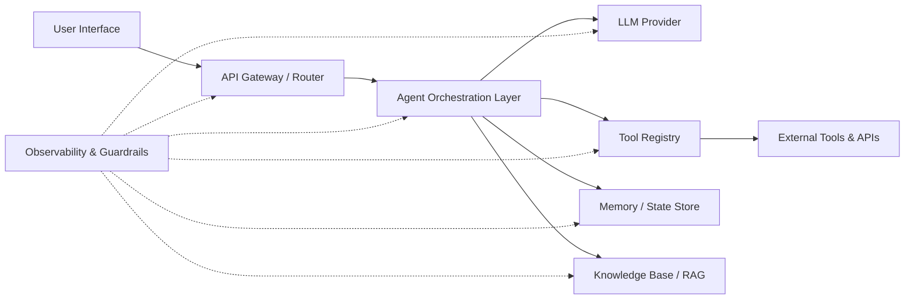
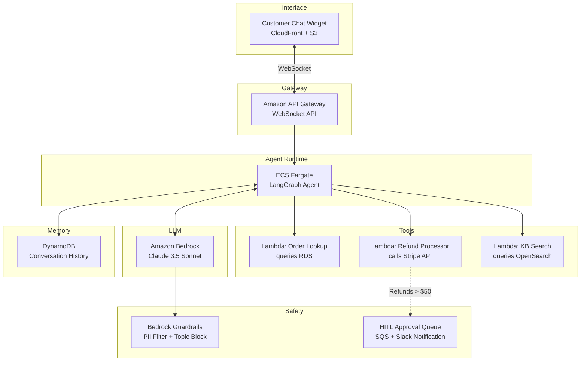
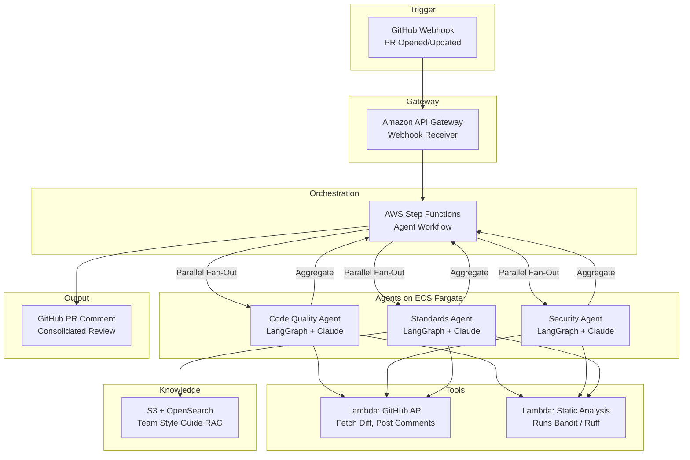
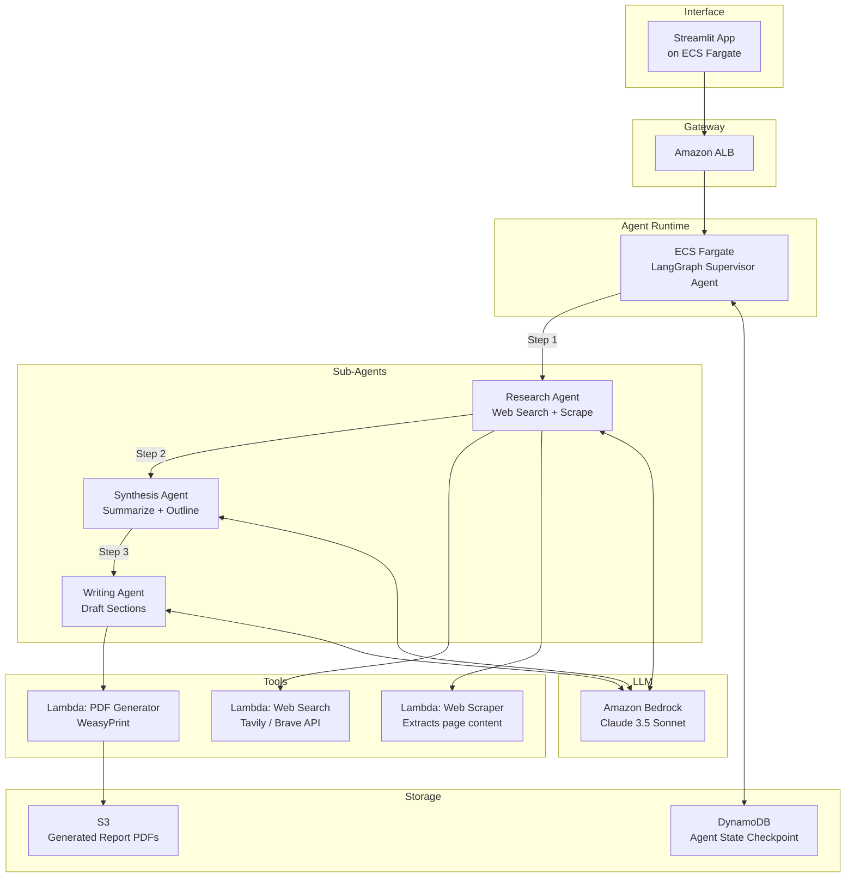

# System Design: Agentic Systems

## 1. Components

An agentic system is a software architecture where one or more autonomous AI agents perceive their environment, make decisions, take actions via tools, and iterate toward a goal—often without explicit step-by-step human instruction. The core components of a production agentic system on AWS include:

| Component | AWS Services / Frameworks | Purpose |
|-----------|--------------------------|---------|
| **User Interface** | Amazon CloudFront + S3 (Static SPA), AWS Amplify | The front-end through which users submit goals, view agent reasoning traces, and receive final outputs. |
| **API Gateway / Router** | Amazon API Gateway, AWS ALB | Receives user requests, authenticates them, rate-limits, and routes to the appropriate agent backend. |
| **Agent Orchestration** | Amazon ECS Fargate (running LangGraph / CrewAI), AWS Step Functions | The core runtime that manages the agent loop: perceive → reason → act → observe → repeat. Defines the graph of nodes and edges that the agent traverses. |
| **LLM Provider** | Amazon Bedrock (Claude, Llama, Mistral), OpenAI API via Secrets Manager | The foundational model that provides reasoning, planning, and natural language generation capabilities. |
| **Tool Registry** | AWS Lambda Functions, Amazon ECS microservices, MCP Servers | A catalog of callable tools (functions) that the agent can invoke: database queries, web searches, code execution, API calls, etc. |
| **Memory / State Store** | Amazon DynamoDB (Short-term), Amazon ElastiCache Redis (Session), Amazon S3 (Long-term) | Stores conversation history, intermediate agent state (scratchpad), and long-term user preferences or learned facts. |
| **Knowledge Base / RAG** | Amazon Bedrock Knowledge Bases, Amazon OpenSearch Serverless (Vector), Amazon S3 (Documents) | Provides the agent with grounded, domain-specific context via Retrieval-Augmented Generation to reduce hallucinations. |
| **Observability** | Amazon CloudWatch, AWS X-Ray, LangSmith / Arize (External) | Tracks agent traces (each step of reasoning and tool use), LLM token costs, latency, and error rates. |
| **Guardrails** | Amazon Bedrock Guardrails, Custom Lambda validators | Prevents the agent from generating harmful content, leaking PII, or executing dangerous tool calls. |

## 2. Importance of Component to the System

*   **Agent Orchestration** is the heart. It defines *how* the agent thinks: whether it uses a simple ReAct loop, a plan-and-execute strategy, or a multi-agent graph with specialized sub-agents. The quality of this orchestration determines whether the agent solves complex, multi-step problems or gets stuck in loops.
*   **Tool Registry** is what makes the agent *useful*. An LLM without tools is a chatbot. An LLM with tools that can query databases, call APIs, and execute code becomes an autonomous problem solver.
*   **Memory / State Store** is what makes the agent *intelligent over time*. Without memory, every interaction starts from zero. Short-term memory (conversation buffer) enables multi-turn dialogues; long-term memory enables personalization and learning.
*   **Knowledge Base / RAG** is what makes the agent *accurate*. It grounds the LLM's responses in facts from your proprietary data, dramatically reducing hallucinations on domain-specific questions.
*   **Guardrails** are what make the agent *safe*. Without guardrails, an autonomous agent could execute destructive tool calls, leak sensitive data, or generate harmful outputs. This is the trust boundary.
*   **Observability** is what makes the agent *debuggable*. Agent failures are notoriously difficult to diagnose because they involve non-deterministic LLM reasoning. Full trace logging of every thought-step, tool call, and LLM response is essential.

## 3. Considerations

### Fault Tolerance
*   **LLM Provider Fallback:** Configure agent orchestration to fall back from a primary model (e.g., Claude 3.5 Sonnet on Bedrock) to a secondary model (e.g., Llama 3 on Bedrock) if the primary provider returns errors or hits rate limits.
*   **Tool Call Retry with Backoff:** If a tool call fails (e.g., an external API is down), the agent should retry with exponential backoff rather than immediately failing the entire task. Implement circuit breaker patterns for chronically failing tools.
*   **Checkpointing:** In LangGraph, enable state checkpointing (e.g., to DynamoDB) so that if the agent process crashes mid-execution, it can resume from the last saved state rather than restarting from scratch.

### Observability
*   **Full Trace Logging:** Log every node execution in the agent graph: the LLM prompt, the raw LLM response, the tool selected, the tool input, and the tool output. Use LangSmith or ship structured traces to CloudWatch.
*   **Token Cost Tracking:** Emit CloudWatch metrics for `prompt_tokens`, `completion_tokens`, and `total_cost_usd` per agent run to monitor and forecast LLM spending.
*   **Latency Breakdown:** Use AWS X-Ray to trace latency across the full request lifecycle: API Gateway → Agent Orchestration → LLM call → Tool execution → Response.

### Flexibility
*   **Model-Agnostic Orchestration:** Design the agent graph to be LLM-agnostic. Use an abstraction layer (e.g., LangChain's `BaseChatModel` interface) so that swapping from OpenAI GPT-4o to Bedrock Claude requires changing a config variable, not rewriting agent logic.
*   **Dynamic Tool Loading:** Allow tools to be registered and deregistered at runtime (e.g., via an MCP server registry) without redeploying the agent. This enables A/B testing new tools and gradual rollouts.

### Composability
*   **Multi-Agent Architectures:** Decompose complex tasks into specialized sub-agents (e.g., a "Research Agent," a "Coding Agent," a "Review Agent") that communicate via a supervisor or swarm pattern in LangGraph. Each sub-agent is a composable, testable unit.
*   **Shared Tool Servers:** Deploy tools as independent MCP (Model Context Protocol) servers on ECS Fargate. Multiple agents can discover and call the same toolset, promoting reuse and reducing duplication.

### Scalability
*   **Horizontal Agent Scaling:** Deploy the agent runtime on ECS Fargate with auto-scaling policies tied to queue depth (SQS messages pending) or concurrent request count. Each task runs in its own isolated container.
*   **Asynchronous Execution:** For long-running agent tasks (e.g., deep research that may take minutes), use an async pattern: the API immediately returns a `task_id`, the agent runs in the background on ECS, and the client polls or receives a webhook on completion.

### Parallelization
*   **Parallel Tool Calls:** Modern LLMs (GPT-4o, Claude) support parallel tool calling—issuing multiple tool calls in a single response. The orchestration layer should execute these concurrently (e.g., using `asyncio.gather` in Python) rather than sequentially.
*   **Map-Reduce in Agent Graphs:** In LangGraph, use the `Send` API to fan-out work to multiple parallel sub-graph executions (e.g., researching 5 topics simultaneously) and then aggregate results in a reducer node.

### Storage
*   **Conversation Memory:** Use DynamoDB for durable, low-latency storage of conversation history and agent state, keyed by `session_id` and `thread_id`.
*   **Vector Store for RAG:** Use Amazon OpenSearch Serverless (Vector Engine) or Amazon Bedrock Knowledge Bases backed by S3 for storing and retrieving document embeddings. Choose dimensionality and distance metric based on the embedding model used.
*   **Artifact Storage:** If the agent generates files (reports, code, images), persist them to S3 with pre-signed URLs for secure, time-limited access by the user.

### Security
*   **Tool Call Authorization:** Implement a permission model where each tool has a required IAM-like permission level. Before executing a tool call, the orchestration layer checks whether the current user's role is authorized to invoke that tool.
*   **Secrets Management:** Store all API keys (OpenAI, third-party APIs) in AWS Secrets Manager. The ECS task role grants access to specific secrets, and keys are never hardcoded or passed through environment variables in plain text.
*   **Input/Output Sanitization:** Use Amazon Bedrock Guardrails to scan both user inputs (prompt injection attacks) and LLM outputs (PII leakage, harmful content) before they reach the user.

### Governance
*   **Audit Trail:** Log every agent action (tool calls, LLM invocations, decisions) to an immutable audit log (e.g., CloudWatch Logs with a retention policy or S3 with Object Lock) for compliance and post-incident analysis.
*   **Human-in-the-Loop (HITL):** For high-stakes actions (e.g., sending an email, deleting a record, executing a financial transaction), require explicit human approval before the agent proceeds. Implement this as an interrupt node in the LangGraph graph.
*   **Cost Governance:** Set per-user and per-agent token budgets. If an agent exceeds its allocated token budget in a single run, forcefully terminate the run and alert the operations team.

## 4. Interview Strategies

When discussing agentic system design in an interview:

1.  **Define "Agent" Precisely:** Start by defining what an agent is in your design: "An agent is an LLM-powered loop that receives a goal, decomposes it into steps, selects and executes tools, observes the results, and iterates until the goal is met or a termination condition is reached."
2.  **Draw the Agent Loop:** Sketch the core ReAct (Reason → Act → Observe) loop or the Plan-and-Execute pattern. Show the interviewer that you understand the fundamental control flow before discussing infrastructure.
3.  **Emphasize Safety and Guardrails:** This is a differentiator. Many candidates discuss the happy path. Proactively address: "What if the agent hallucinates a tool call? What if it enters an infinite loop? What if it leaks PII?" Propose guardrails, maximum iteration limits, and HITL checkpoints.
4.  **Discuss State Management:** Show depth by addressing how the agent maintains state across turns (short-term memory), across sessions (long-term memory), and across agent restarts (checkpointing).
5.  **Quantify Costs:** LLM-backed systems are expensive. Demonstrate financial awareness: "A single complex agent run with GPT-4o might consume 50K tokens (~$0.50). At 10,000 daily users, that's $5,000/day in LLM costs alone. I'd use caching, smaller models for simple sub-tasks, and token budgets to manage this."

## 5. Whiteboard Exercises

### Exercise 1: Customer Support Agent

**Prompt:** Design an agentic system for a SaaS company that can autonomously handle Tier 1 customer support tickets—answering product questions, looking up order status, and processing simple refunds.

**Key Discussion Points:**
*   The agent uses RAG (via OpenSearch) to answer product knowledge questions. For order lookups, it calls a structured API tool.
*   Refund processing is gated by a Human-in-the-Loop check: refunds above $50 are queued for human approval via SQS → Slack.
*   Bedrock Guardrails filters PII from responses and blocks off-topic conversations.

---

### Exercise 2: Autonomous Code Review Agent

**Prompt:** Design an agentic system that automatically reviews pull requests in a GitHub repository, checking for code quality, security vulnerabilities, and adherence to team coding standards.

**Key Discussion Points:**
*   Step Functions orchestrates a fan-out/fan-in pattern: three specialized agents run in parallel, each reviewing different aspects of the PR.
*   The Security Agent invokes a static analysis tool (Bandit) via Lambda and interprets the raw output using the LLM.
*   The Standards Agent uses RAG against the team's internal style guide stored in S3/OpenSearch.
*   Results from all three agents are aggregated and posted as a single, consolidated PR comment via the GitHub API.

---

### Exercise 3: Research and Report Generation Agent

**Prompt:** Design an agentic system where a user provides a research topic, and an agent autonomously searches the web, synthesizes findings from multiple sources, and generates a structured PDF report.

**Key Discussion Points:**
*   The Supervisor Agent manages a sequential, multi-agent pipeline: Research → Synthesis → Writing.
*   The Research Agent performs multiple web searches and scrapes relevant pages, storing raw findings in the agent's state.
*   The Synthesis Agent reads the raw findings and produces a structured outline with key themes. The Writing Agent expands each outline section into full prose.
*   State is checkpointed to DynamoDB after each sub-agent completes, enabling resumability if the process is interrupted.
*   The final PDF is generated via a Lambda function (using WeasyPrint) and stored in S3 with a pre-signed URL returned to the user.
