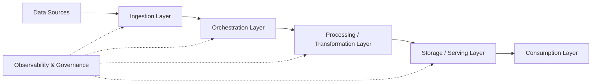
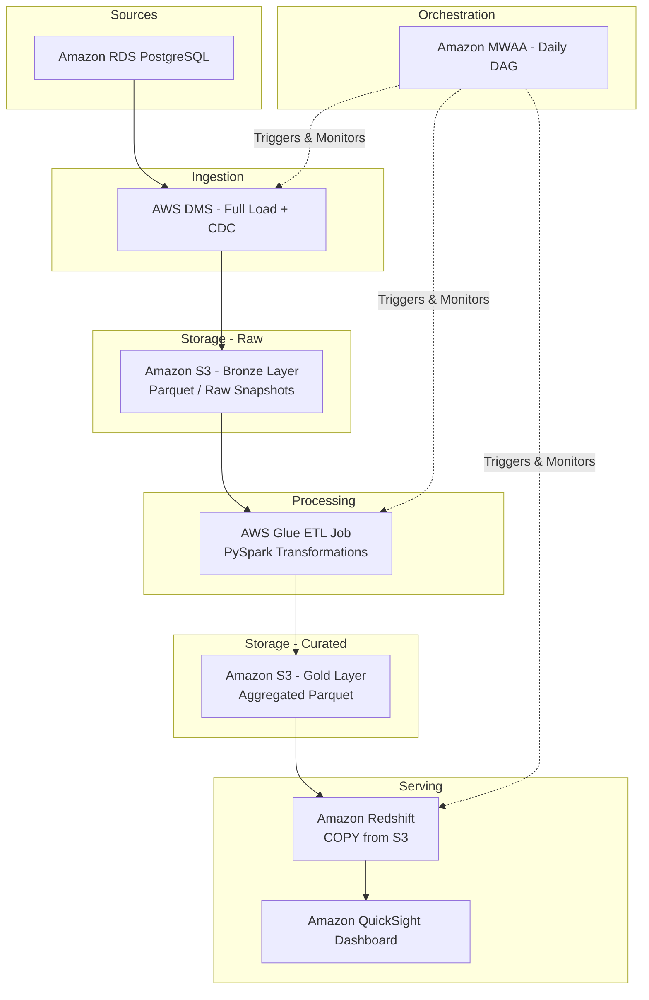
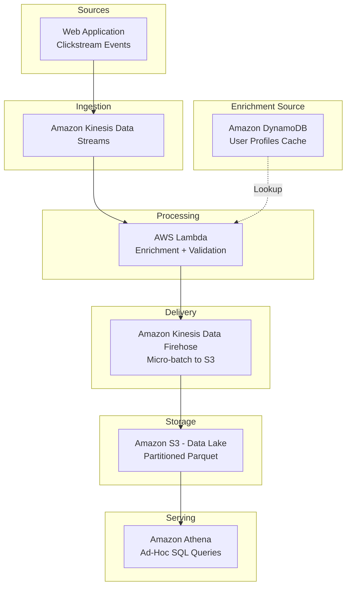
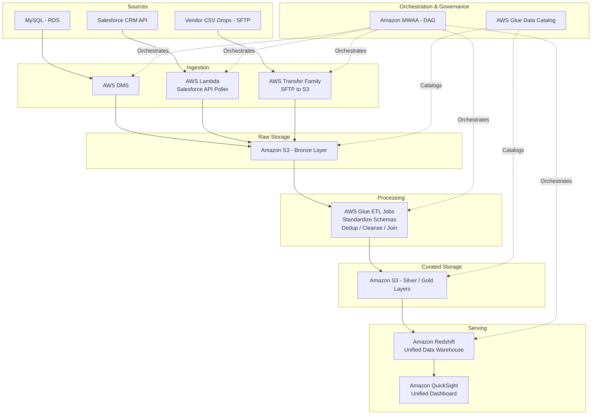

# System Design: Data Pipelines

## 1. Components

A data pipeline is a series of processing steps that move data from one or more sources to a destination, applying transformations along the way. The core components of a production data pipeline on AWS include:

| Component | AWS Services | Purpose |
|-----------|-------------|---------|
| **Ingestion** | Amazon Kinesis Data Streams, AWS DMS, Amazon MSK (Kafka), AWS Glue Crawlers | Captures raw data from operational databases, APIs, event streams, and file drops. |
| **Orchestration** | Amazon MWAA (Managed Airflow), AWS Step Functions | Schedules, sequences, and monitors the execution of pipeline tasks (DAGs). |
| **Processing / Transformation** | AWS Glue (Spark), Amazon EMR, AWS Lambda | Cleans, enriches, validates, and reshapes data. Handles both batch and micro-batch workloads. |
| **Storage** | Amazon S3 (Data Lake), Amazon Redshift (Warehouse), Amazon DynamoDB (Key-Value) | Persists data at various stages: raw, curated, and aggregated. |
| **Serving / Consumption** | Amazon Athena, Amazon QuickSight, Amazon Redshift Spectrum | Provides query interfaces and dashboards for analysts, data scientists, and business users. |
| **Observability** | Amazon CloudWatch, AWS CloudTrail, Amazon SNS | Monitors pipeline health, alerts on failures, and audits data access. |
| **Governance** | AWS Glue Data Catalog, AWS Lake Formation | Manages metadata, schema evolution, data lineage, and access control policies. |

## 2. Importance of Component to the System

Each component plays a vital role in ensuring data flows reliably from source to insight:

*   **Ingestion** is the front door. Without a resilient ingestion layer, upstream failures (a database going down, an API rate-limiting) cascade into stale or missing data downstream.
*   **Orchestration** is the brain. It ensures tasks run in the correct order, retries on failure, and provides a single pane of glass to understand what ran, when, and whether it succeeded.
*   **Processing** is where business value is created. Raw data has limited utility; transformations apply business rules, join disparate datasets, and produce clean, trustworthy outputs.
*   **Storage** is the foundation. An improperly designed storage layer leads to high query costs, slow dashboards, and data duplication.
*   **Observability** is the safety net. It tells engineers when something is broken before business stakeholders notice stale reports.
*   **Governance** is the trust layer. It ensures only authorized users access sensitive data and that the lineage of every metric can be traced back to its source.

## 3. Considerations

### Fault Tolerance
*   **Dead Letter Queues (DLQs):** Configure Amazon SQS DLQs for Kinesis and Lambda so that poisoned messages (malformed records) are isolated rather than blocking the entire pipeline.
*   **Idempotent Writes:** Design transformations to be safely re-runnable. If a Glue job fails halfway, re-running it should not produce duplicates. Achieve this via upsert patterns or using S3 partition overwriting.
*   **Retry Policies:** Amazon MWAA (Airflow) supports automatic task retries with exponential backoff. Configure `retries=3` and `retry_delay=timedelta(minutes=5)` as sensible defaults.

### Observability
*   **CloudWatch Metrics & Alarms:** Emit custom metrics (e.g., `rows_processed`, `pipeline_duration_seconds`) from Glue jobs and set CloudWatch Alarms that trigger Amazon SNS notifications when thresholds are breached.
*   **Data Quality Checks:** Integrate AWS Glue Data Quality rules to validate row counts, null percentages, and schema conformity at each stage of the pipeline.
*   **Centralized Logging:** Ship all Glue job logs, Lambda logs, and MWAA task logs to a single CloudWatch Log Group for unified querying.

### Flexibility
*   **Schema Evolution:** Use AWS Glue Schema Registry with Apache Avro or JSON Schema to manage schema changes without breaking downstream consumers.
*   **Pluggable Sources/Sinks:** Design the pipeline with a clear contract at the ingestion boundary so that adding a new data source (e.g., a new SaaS API) only requires a new ingestion connector, not a rewrite of the transformation logic.

### Composability
*   **Modular DAGs:** Break monolithic DAGs into smaller, reusable sub-DAGs or task groups in Airflow. A "bronze-to-silver" transformation DAG can be reused across multiple source tables.
*   **Shared Libraries:** Publish common transformation functions (e.g., PII masking, date normalization) as internal Python packages installable via a private CodeArtifact repository.

### Scalability
*   **Horizontal Scaling:** AWS Glue auto-scales the number of Data Processing Units (DPUs) based on data volume. Amazon EMR can use EC2 Auto Scaling groups or Spot Instances for cost-effective burst capacity.
*   **Partitioning Strategy:** Partition data in S3 by date (e.g., `s3://bucket/table/year=2026/month=04/day=17/`) to enable partition pruning for extremely fast queries via Athena.

### Parallelization
*   **Concurrent Task Execution:** In Amazon MWAA, set `parallelism` and `max_active_tasks_per_dag` to allow independent tasks (e.g., ingesting from 10 different API endpoints) to run simultaneously.
*   **Spark Parallelism:** AWS Glue (Spark) inherently parallelizes data processing across worker nodes. Tune `spark.sql.shuffle.partitions` to match the data volume.

### Storage
*   **Lakehouse Architecture:** Use Amazon S3 as the primary data lake (Bronze / Silver / Gold layers) and Amazon Redshift as the serving warehouse for high-performance analytical queries.
*   **File Formats:** Store data in columnar formats like Apache Parquet or Apache Iceberg for optimal compression and query performance. Avoid CSV/JSON in downstream layers.
*   **Lifecycle Policies:** Use S3 Lifecycle Policies to transition old, infrequently accessed data from S3 Standard to S3 Glacier for cost savings.

### Security
*   **Encryption:** Enable S3 Server-Side Encryption (SSE-S3 or SSE-KMS) for all buckets. Enforce encryption in transit via bucket policies that deny non-HTTPS requests.
*   **IAM Least Privilege:** Create dedicated IAM Roles for each pipeline component (e.g., a Glue role that can only read from source S3 and write to target S3), avoiding shared admin credentials.
*   **VPC Isolation:** Run Glue jobs and EMR clusters within a private VPC subnet with no direct internet access. Use VPC Endpoints (Gateway Endpoints for S3, Interface Endpoints for Glue) for private connectivity.

### Governance
*   **Data Catalog:** Register all datasets in the AWS Glue Data Catalog. Enforce that every table has a description, owner, and classification tag.
*   **Access Control:** Use AWS Lake Formation to implement fine-grained column-level and row-level security on data lake tables.
*   **Lineage Tracking:** Tag pipeline outputs with metadata (source system, transformation version, run ID) to enable full data lineage from source to dashboard.

## 4. Interview Strategies

When discussing data pipeline system design in an interview:

1.  **Start with Requirements:** Always ask clarifying questions. "What is the data volume? What is the expected latency (batch, near-real-time, or real-time)? Who are the consumers?"
2.  **Draw the High-Level Flow First:** Sketch the Source → Ingest → Process → Store → Serve flow before diving into specific services. Show the interviewer you think architecturally before jumping to implementation.
3.  **Justify Every Service Choice:** Don't just say "use Kinesis." Say: "I'd use Kinesis Data Streams here because we need sub-second ingestion latency for click-stream data, and it integrates natively with Lambda for serverless processing."
4.  **Address Failure Modes Proactively:** Before the interviewer asks, walk through "What happens if the Glue job fails? What happens if the source database is down?" This demonstrates production-level thinking.
5.  **Discuss Trade-offs:** Show maturity by discussing trade-offs: "We could use Lambda for processing, which is cheaper for small volumes, but Glue/EMR would be more cost-effective and performant at scale because Lambda has a 15-minute timeout and limited memory."

## 5. Whiteboard Exercises

### Exercise 1: E-Commerce Order Analytics Pipeline

**Prompt:** Design a batch data pipeline for an e-commerce company that processes daily order data from an RDS PostgreSQL database and serves aggregated sales metrics to a QuickSight dashboard.

**Key Discussion Points:**
*   Use DMS with Change Data Capture (CDC) to avoid heavy full-table scans on the production database every day.
*   The Glue job calculates daily revenue, average order value, and top products, writing aggregated Parquet to the Gold layer.
*   Redshift uses the `COPY` command for high-throughput bulk loads from S3.

---

### Exercise 2: Real-Time Clickstream Ingestion Pipeline

**Prompt:** Design a near-real-time pipeline that ingests website clickstream events, enriches them with user profile data, and makes them available for ad-hoc querying within 5 minutes.

**Key Discussion Points:**
*   Kinesis Data Streams handles the high-throughput, low-latency ingestion of raw events.
*   Lambda consumes from Kinesis, enriches each event with user profile data from DynamoDB (fast key-value lookups), and writes to Firehose.
*   Firehose buffers events and micro-batches them into Parquet files on S3 (every 60-120 seconds), achieving the "within 5 minutes" SLA.
*   Athena provides serverless, on-demand querying directly against S3 without needing a dedicated cluster.

---

### Exercise 3: Multi-Source Data Warehouse Consolidation Pipeline

**Prompt:** Design a pipeline that consolidates data from three different sources (a MySQL database, a Salesforce CRM API, and daily CSV file drops from a vendor) into a single Redshift data warehouse for unified reporting.

**Key Discussion Points:**
*   Each source uses a different ingestion pattern tailored to its nature: DMS for databases, Lambda for APIs, and AWS Transfer Family for SFTP file drops.
*   All raw data lands in S3 (Bronze layer) in its native format before any transformation, preserving a complete audit trail.
*   Glue ETL jobs standardize disparate schemas into a common model, deduplicate records, and produce joined "Gold" tables.
*   The Glue Data Catalog serves as the central metadata repository, enabling both Athena and Redshift Spectrum to query the same cataloged tables.
