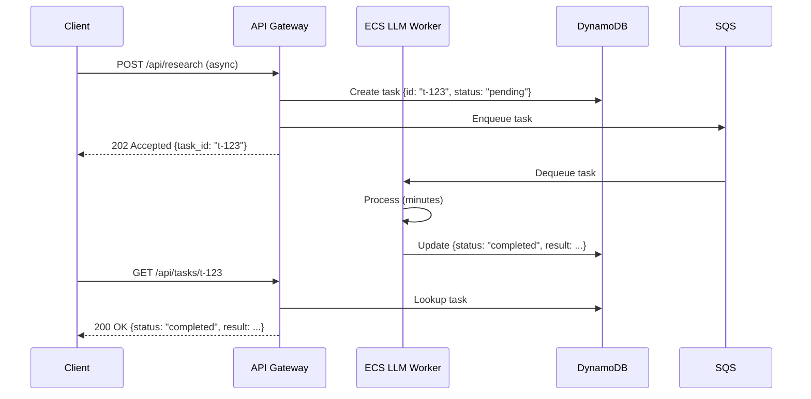
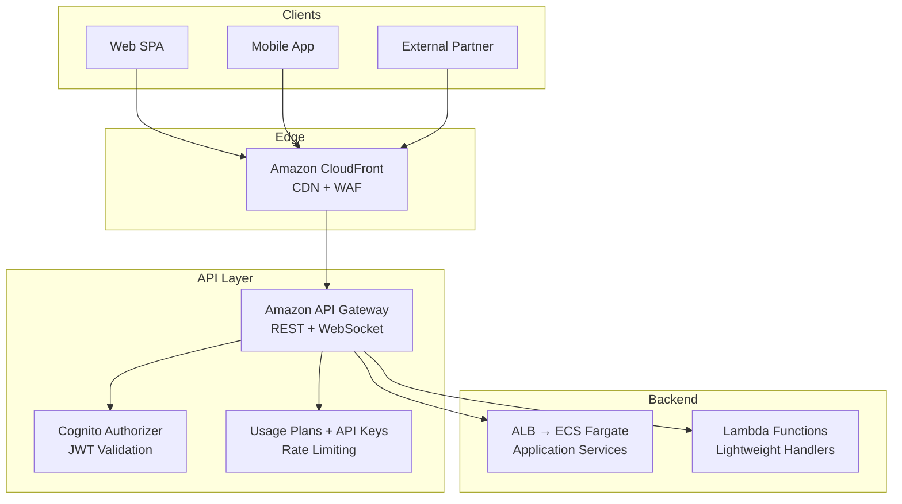

# API Design in System Design

An API (Application Programming Interface) is the contract between services. In system design, choosing the right API paradigm, designing clean endpoints, and implementing proper error handling, authentication, and rate limiting are as important as the underlying infrastructure. A well-designed API is intuitive, consistent, and resilient.

---

## 1. API Paradigms

### REST (Representational State Transfer)
The dominant paradigm for web APIs. Uses HTTP methods to operate on resources identified by URLs.

| HTTP Method | Action | Example | Idempotent? |
|------------|--------|---------|-------------|
| `GET` | Read | `GET /api/users/123` | Yes |
| `POST` | Create | `POST /api/users` | No |
| `PUT` | Full Update (replace) | `PUT /api/users/123` | Yes |
| `PATCH` | Partial Update | `PATCH /api/users/123` | Yes |
| `DELETE` | Delete | `DELETE /api/users/123` | Yes |

*   **Strengths:** Universal tooling, cacheable (GET responses), human-readable URLs, stateless.
*   **Weaknesses:** Over-fetching (GET returns all fields even if client needs only one), under-fetching (client must make multiple requests to assemble a view), no built-in schema validation.
*   **AWS:** Amazon API Gateway (REST API type).

### GraphQL
A query language for APIs where the client specifies exactly which fields it needs. Single endpoint, client-driven queries.

```graphql
query {
  user(id: 123) {
    name
    email
    orders(last: 5) {
      id
      total
    }
  }
}
```

*   **Strengths:** Eliminates over/under-fetching. Single round-trip for complex, nested data. Strong typing via schema definition.
*   **Weaknesses:** Complex caching (POST-based queries). Risk of expensive queries without depth/complexity limits. Steeper learning curve.
*   **AWS:** AWS AppSync (managed GraphQL).

### gRPC (Google Remote Procedure Call)
A high-performance, binary RPC framework using Protocol Buffers (protobuf) for serialization and HTTP/2 for transport.

*   **Strengths:** Extremely fast (binary serialization, HTTP/2 multiplexing). Built-in bi-directional streaming. Strongly typed contracts via `.proto` files. Code generation for multiple languages.
*   **Weaknesses:** Not human-readable (binary format). Browser support requires grpc-web proxy. Harder to debug with standard HTTP tools (curl, Postman).
*   **AWS:** ALB supports gRPC routing. API Gateway does not natively support gRPC.
*   **Use Case:** Internal service-to-service communication where performance is critical. ML model serving (TensorFlow Serving, Triton Inference Server use gRPC).

### WebSockets
A persistent, bi-directional communication channel over a single TCP connection. Unlike HTTP (request-response), either side can send messages at any time.

*   **Strengths:** Real-time, low-latency communication. No polling overhead.
*   **Weaknesses:** Stateful connections complicate horizontal scaling. Load balancer must support sticky sessions or connection migration.
*   **AWS:** API Gateway WebSocket APIs, ALB WebSocket support.
*   **Use Case:** Chat applications, LLM token streaming (streaming responses word-by-word to the UI), live dashboards, collaborative editing.

### Server-Sent Events (SSE)
A unidirectional streaming protocol where the server pushes events to the client over a long-lived HTTP connection.

*   **Strengths:** Simpler than WebSockets (standard HTTP, no special protocol). Built-in reconnection and event IDs. Works through most proxies/firewalls.
*   **Weaknesses:** Server-to-client only (client cannot send messages back on the same connection).
*   **Use Case:** LLM streaming responses (OpenAI and Anthropic APIs use SSE for token-by-token streaming). Real-time log tailing. Live pipeline status updates.

---

## 2. API Design Best Practices

### URL Design
*   Use **nouns**, not verbs: `/api/users/123` not `/api/getUser?id=123`.
*   Use **plural nouns**: `/api/users` not `/api/user`.
*   Use **nested resources** for relationships: `/api/users/123/orders`.
*   Use **query parameters** for filtering/sorting: `/api/orders?status=pending&sort=created_at`.

### Response Design
*   Return consistent response envelopes:
    ```json
    {
      "data": { ... },
      "meta": { "page": 1, "total": 100 },
      "errors": null
    }
    ```
*   Use standard HTTP status codes consistently:

| Code | Meaning | When to Use |
|------|---------|-------------|
| `200 OK` | Success | GET, PUT, PATCH |
| `201 Created` | Resource created | POST |
| `204 No Content` | Success, no body | DELETE |
| `400 Bad Request` | Client error (validation) | Malformed JSON, missing required field |
| `401 Unauthorized` | Authentication failed | Missing/invalid token |
| `403 Forbidden` | Authorization failed | Valid token, insufficient permissions |
| `404 Not Found` | Resource doesn't exist | GET/PUT/DELETE on non-existent ID |
| `409 Conflict` | State conflict | Duplicate creation, version mismatch |
| `429 Too Many Requests` | Rate limited | Client exceeded rate limit |
| `500 Internal Server Error` | Server-side failure | Unhandled exception |
| `503 Service Unavailable` | Temporarily overloaded | Backend dependency down |

### Pagination
For endpoints that return lists, always paginate:
*   **Offset-based:** `?page=2&limit=20` — Simple but poor performance on deep pages (DB must scan and discard offset rows).
*   **Cursor-based:** `?cursor=eyJpZCI6MTIzfQ==&limit=20` — More efficient for large datasets. The cursor encodes the position, and the DB seeks directly to it.

### Versioning
*   **URL Versioning:** `/api/v1/users` → `/api/v2/users`. Most explicit and common.
*   **Header Versioning:** `Accept: application/vnd.myapi.v2+json`. Cleaner URLs but harder to discover.
*   **Best Practice:** Use URL versioning. When introducing breaking changes, maintain the old version for a deprecation period with clear migration documentation.

---

## 3. Authentication and Authorization

| Method | How It Works | Use Case |
|--------|-------------|----------|
| **API Key** | Static key passed in header (`x-api-key`). | Simple service-to-service auth, public APIs with usage tracking. |
| **JWT (JSON Web Token)** | Self-contained token with encoded claims (user ID, roles, expiry). Verified via signature, no DB lookup needed. | User authentication for SPAs, mobile apps. |
| **OAuth 2.0** | Delegated authorization framework. Issues access tokens with scoped permissions. | Third-party API access (e.g., "Sign in with Google"). |
| **IAM (AWS SigV4)** | AWS request signing using IAM credentials. | AWS service-to-service communication. |

**AWS Implementation:**
*   **Amazon Cognito:** Managed user pools with JWT-based authentication. Integrates natively with API Gateway.
*   **API Gateway Authorizers:** Lambda authorizer for custom auth logic, Cognito authorizer for JWT validation, IAM authorizer for SigV4-signed requests.

---

## 4. Rate Limiting and Throttling

Rate limiting protects the API from abuse and ensures fair usage across clients.

### Common Algorithms
*   **Token Bucket:** A bucket holds N tokens. Each request consumes a token. Tokens refill at a fixed rate. If the bucket is empty, requests are rejected (429). Allows short bursts.
*   **Sliding Window:** Tracks the number of requests in a rolling time window (e.g., last 60 seconds). Smoother than fixed-window, which can allow 2x burst at window boundaries.
*   **Fixed Window Counter:** Counts requests in fixed time slots (e.g., per minute). Simple but susceptible to burst at window edges.

### AWS Implementation
*   **API Gateway:** Built-in throttling with configurable `rateLimit` (requests per second) and `burstLimit` per stage and per API key.
*   **AWS WAF:** Rate-based rules that can block IPs exceeding a threshold.

---

## 5. API Patterns for AI Systems

### Streaming LLM Responses (SSE)
LLM responses are generated token-by-token. Instead of waiting for the full response (which may take 10–30 seconds), stream tokens to the client as they are generated.

```
Client                           Server
  |--- POST /api/chat ------------->|
  |                                 |  (LLM generates tokens)
  |<--- SSE: data: {"token": "The"} |
  |<--- SSE: data: {"token": " answer"}|
  |<--- SSE: data: {"token": " is"}  |
  |<--- SSE: data: [DONE] ---------|
```

### Async Job Pattern for Long-Running AI Tasks



### Tool/Function Calling API
For agentic systems, the LLM returns structured tool call requests. The API layer must support a schema for declaring available tools and parsing tool call responses:

```json
{
  "tools": [
    {
      "name": "query_database",
      "description": "Execute a read-only SQL query",
      "parameters": {
        "type": "object",
        "properties": {
          "query": { "type": "string" }
        },
        "required": ["query"]
      }
    }
  ]
}
```

---

## 6. AWS API Architecture


