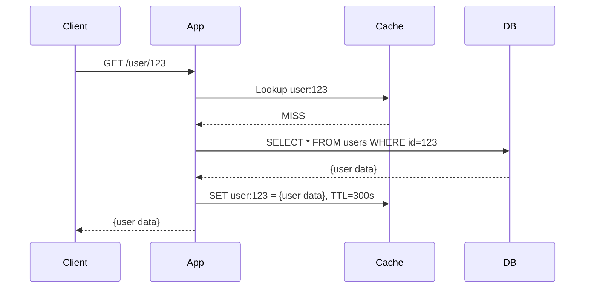
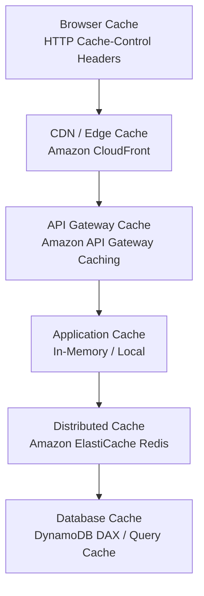
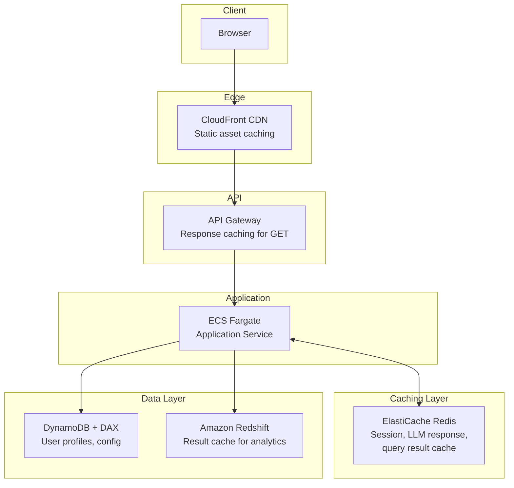

# Caching in System Design

Caching is storing copies of frequently or recently accessed data in a faster storage layer so that future requests for that data can be served more quickly. It is one of the most impactful performance optimization strategies in system design, directly reducing latency, database load, and API costs.

---

## 1. Why Caching Matters

| Without Cache | With Cache |
|---------------|------------|
| Every request hits the database (high latency, high load). | Repeated requests are served from memory in < 1ms. |
| Expensive LLM API calls are repeated for identical prompts. | Identical prompts return cached responses instantly ($0 cost). |
| Static assets (images, CSS, JS) are served from the origin server on every page load. | Assets are served from a CDN edge node closest to the user. |

---

## 2. Cache Strategies

### Cache-Aside (Lazy Loading)
The application checks the cache first. On a **cache miss**, it queries the database, stores the result in the cache, and returns it to the client. The cache is only populated on demand.

*   **Pros:** Only caches data that is actually requested (memory-efficient). Cache failures are non-fatal (app falls back to DB).
*   **Cons:** Every cache miss incurs a "triple penalty" (cache lookup + DB query + cache write). Data can become stale.
*   **AWS:** ElastiCache (Redis/Memcached) with application-level logic.

### Write-Through
Every write to the database is simultaneously written to the cache. The cache always has the latest data.

*   **Pros:** Cache data is always consistent with the database. No stale reads.
*   **Cons:** Write latency increases (must write to two places). Caches data that may never be read.
*   **AWS:** DynamoDB Accelerator (DAX) implements write-through natively for DynamoDB tables.

### Write-Behind (Write-Back)
Writes go to the cache first, and the cache asynchronously flushes to the database in batches.

*   **Pros:** Very fast writes (cache is in memory). Reduces database write load via batching.
*   **Cons:** Risk of data loss if the cache crashes before flushing. Complex to implement reliably.
*   **Use Case:** High-frequency write scenarios like gaming leaderboards, ad impression counters.

### Read-Through
Similar to Cache-Aside, but the cache itself is responsible for loading data from the database on a miss. The application only talks to the cache.

*   **Pros:** Simpler application code (the cache handles DB loading logic).
*   **Cons:** The cache must be configured with a data-loading function or backed by a service.
*   **AWS:** DAX for DynamoDB provides read-through semantics natively.

---

## 3. Cache Eviction Policies

When the cache reaches its maximum memory capacity, it needs a strategy to decide which entries to remove.

| Policy | Algorithm | Best For |
|--------|-----------|----------|
| **LRU** (Least Recently Used) | Evicts the entry that hasn't been accessed for the longest time. | General purpose. Most common default. |
| **LFU** (Least Frequently Used) | Evicts the entry that has been accessed the fewest times. | Workloads with a consistent hot set. |
| **FIFO** (First In, First Out) | Evicts the oldest entry, regardless of access pattern. | Simple, time-based expiry scenarios. |
| **TTL** (Time-To-Live) | Each entry has an expiration time. Expired entries are removed. | Data that becomes stale after a known duration. |
| **Random** | Evicts a random entry. | When access patterns are unpredictable. |

### Best Practice
In most production systems, use **LRU + TTL** together. LRU handles memory pressure, and TTL ensures stale data is eventually purged even if the cache isn't full.

---

## 4. Caching Layers

Caching can be applied at every layer of the stack:

| Layer | AWS Service | TTL Guidance | What It Caches |
|-------|-------------|-------------|----------------|
| **Browser** | HTTP headers (`Cache-Control`, `ETag`) | Minutes to hours | Static assets (JS, CSS, images). |
| **CDN** | Amazon CloudFront | Seconds to days | Static files, API responses (GET). |
| **API Gateway** | API Gateway Cache | Seconds to minutes | GET endpoint responses. |
| **Application** | In-process dict / LRU cache | Seconds | Hot configuration, feature flags. |
| **Distributed** | Amazon ElastiCache (Redis) | Seconds to hours | Session data, query results, LLM responses. |
| **Database** | DynamoDB DAX | Microseconds to seconds | Individual DynamoDB items and query results. |

---

## 5. Caching in Data Engineering

### Query Result Caching
*   Cache frequently run analytical queries. Amazon Redshift has a built-in **Result Cache** that automatically returns cached results for identical queries if the underlying data hasn't changed.
*   Amazon Athena supports query result reuse for repeated queries against unchanged S3 partitions.

### Metadata Caching
*   Cache schema metadata from the AWS Glue Data Catalog locally in pipeline workers to avoid API round-trips on every task execution.

### Intermediate Data Caching
*   In multi-stage ETL pipelines, cache the output of expensive transformation stages in S3 or Redis. If a downstream stage fails and retries, it can read the cached intermediate result instead of re-running the upstream transformation.

---

## 6. Caching in AI Systems

### Semantic Caching for LLMs
Traditional caching uses exact key matches. For LLMs, the same question can be phrased differently ("What is caching?" vs. "Explain the concept of caching"). **Semantic caching** embeds the query into a vector and checks for similar (not identical) cached queries using cosine similarity.

*   **Implementation:** Embed the user prompt → Search a vector store (OpenSearch) for cached prompts with similarity > 0.95 → If found, return the cached LLM response → If not, call the LLM and cache the prompt embedding + response.
*   **Impact:** Can reduce LLM API costs by 30–60% for applications with repetitive query patterns (e.g., customer support, FAQ bots).

### Embedding Caching
*   Computing embeddings via an API (Bedrock, OpenAI) costs money and adds latency. Cache embeddings for documents that are frequently re-embedded (e.g., during iterative RAG development).
*   Store in ElastiCache Redis or a persistent vector store (OpenSearch).

### KV Cache (Internal LLM)
*   LLMs internally use a Key-Value cache to avoid recomputing attention for previous tokens during autoregressive generation. This is managed by the inference framework (vLLM, TGI), not the application developer, but understanding it is important for optimizing inference throughput and memory.

---

## 7. Common Caching Problems

### Cache Stampede (Thundering Herd)
A popular cache key expires, and hundreds of concurrent requests simultaneously miss the cache and hit the database, potentially overwhelming it.

**Solution:** Use a **lock-based approach**. When a cache miss occurs, only the first request acquires a lock and fetches from the DB. All other concurrent requests wait for the lock to be released and then read the freshly cached value.

### Cache Penetration
Repeated requests for data that does not exist in the database (e.g., querying `user_id = -1`). These always miss the cache and hit the DB.

**Solution:** Use a **Bloom Filter** in front of the cache. If the Bloom Filter says the key doesn't exist, reject the request immediately. Alternatively, cache negative results (e.g., `user:-1 = NULL, TTL=60s`).

### Cache Avalanche
A large number of cache keys expire at the same time (e.g., all set with the same TTL at startup), causing a massive wave of cache misses hitting the database simultaneously.

**Solution:** Add **random jitter** to TTLs. Instead of `TTL=300s`, use `TTL=300 + random(0, 60)s`.

---

## 8. AWS Caching Architecture

