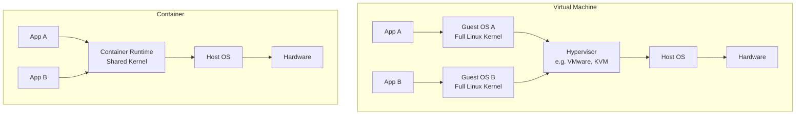
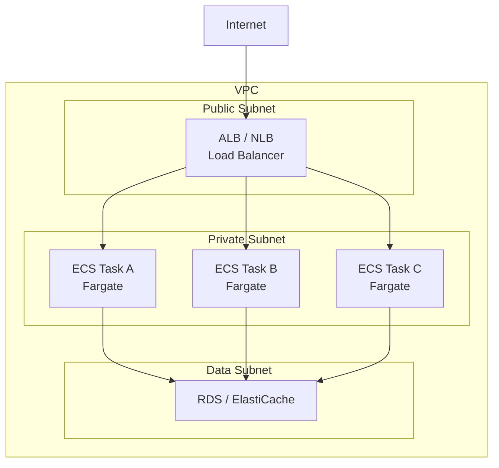
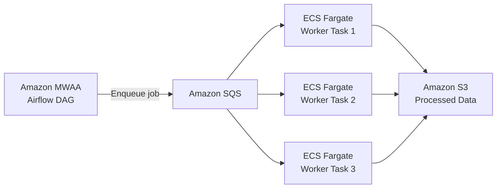
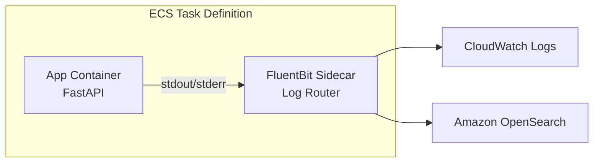
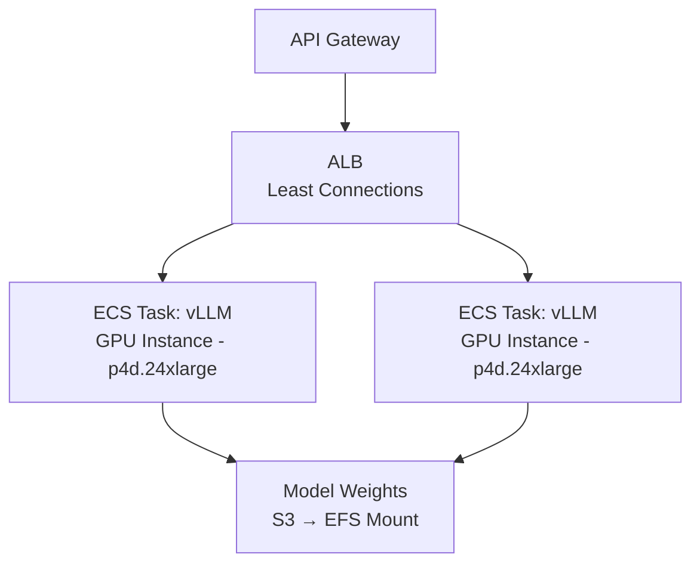
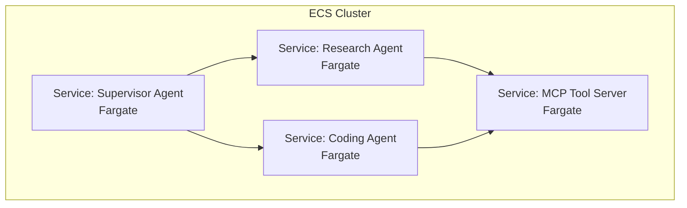
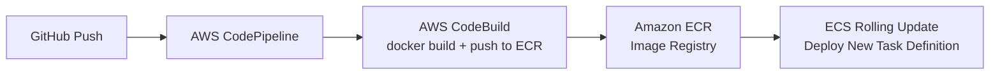

# Containerization in System Design

Containerization is the practice of packaging an application and all of its dependencies (code, runtime, libraries, system tools) into a standardized, portable unit called a **container**. Containers ensure that software runs identically across development, staging, and production environments, eliminating the "works on my machine" problem.

---

## 1. Containers vs Virtual Machines



| Aspect | Virtual Machine | Container |
|--------|----------------|-----------|
| **Isolation** | Full OS-level isolation (separate kernel). | Process-level isolation (shared kernel via namespaces and cgroups). |
| **Size** | Gigabytes (includes entire guest OS). | Megabytes (only app + dependencies). |
| **Startup Time** | Minutes (boot an OS). | Seconds (start a process). |
| **Resource Overhead** | High (duplicated OS per VM). | Low (shared kernel, minimal overhead). |
| **Use Case** | Running different operating systems, maximum isolation. | Microservices, CI/CD, data pipelines, ML inference. |

---

## 2. Docker Fundamentals

Docker is the standard container runtime. Key concepts:

### Dockerfile
A text file that defines how to build a container image, layer by layer.

```dockerfile
# Base image
FROM python:3.12-slim

# Set working directory
WORKDIR /app

# Install dependencies (cached layer)
COPY requirements.txt .
RUN pip install --no-cache-dir -r requirements.txt

# Copy application code
COPY . .

# Expose port
EXPOSE 8000

# Define startup command
CMD ["uvicorn", "main:app", "--host", "0.0.0.0", "--port", "8000"]
```

### Key Concepts
*   **Image:** An immutable, layered filesystem snapshot. Built from a Dockerfile. Stored in a registry.
*   **Container:** A running instance of an image. Ephemeral by default (data is lost when the container stops unless volumes are used).
*   **Registry:** A storage and distribution service for container images. **AWS:** Amazon ECR (Elastic Container Registry).
*   **Layer Caching:** Docker caches each `RUN`, `COPY`, and `ADD` instruction as a layer. Order instructions from least-frequently-changed (OS packages) to most-frequently-changed (application code) to maximize cache hits and reduce build times.
*   **Multi-Stage Builds:** Use separate build and runtime stages to produce minimal production images by discarding build tools and intermediate artifacts.

---

## 3. AWS Container Services

### Amazon ECS (Elastic Container Service)
AWS's proprietary container orchestration service. Manages the lifecycle of containers, including placement, scaling, and networking.

### Amazon ECS with Fargate (Serverless)
Fargate removes the need to manage the underlying EC2 instances. You define CPU and memory per task, and Fargate provisions the compute.

*   **No Servers to Manage:** No EC2 instances to patch, scale, or monitor.
*   **Per-Second Billing:** Pay only for the vCPU and memory your tasks consume.
*   **Best For:** Most workloads. API services, data pipeline workers, LLM inference (non-GPU).

### Amazon ECS with EC2 (Server-Based)
You manage EC2 instances in an Auto Scaling Group. ECS places container tasks on these instances.

*   **GPU Support:** Required for GPU-accelerated workloads (LLM inference with vLLM, model training).
*   **Cost Optimization:** Use Spot Instances for fault-tolerant batch processing (up to 90% savings).
*   **Best For:** GPU workloads, very large-scale deployments where Fargate pricing is less competitive.

### Amazon EKS (Elastic Kubernetes Service)
Managed Kubernetes on AWS. Choose EKS if your team has Kubernetes expertise, needs multi-cloud portability, or requires the full Kubernetes ecosystem (Helm charts, Operators, service mesh).

### Comparison

| Feature | ECS + Fargate | ECS + EC2 | EKS |
|---------|---------------|-----------|-----|
| **Operational Overhead** | Lowest | Medium | Highest |
| **GPU Support** | No | Yes | Yes |
| **Portability** | AWS-only | AWS-only | Multi-cloud (K8s standard) |
| **Ecosystem** | AWS-native integrations | AWS-native | Full Kubernetes ecosystem |
| **Learning Curve** | Low | Medium | High |
| **Cost Model** | Per-task (vCPU + memory) | Per-instance (EC2 pricing) | Control plane + worker nodes |

---

## 4. Container Networking on AWS



*   **awsvpc Network Mode:** Each ECS task gets its own Elastic Network Interface (ENI) and private IP address within the VPC. This is the recommended and default mode for Fargate.
*   **Service Discovery:** AWS Cloud Map provides DNS-based service discovery. Service A can reach Service B via `service-b.local` without hardcoded IPs.
*   **Security Groups:** Applied at the task level (per ENI). Restrict which tasks can communicate with each other and with data stores.

---

## 5. Container Patterns for Data Engineering

### ETL Worker Pool
Deploy Glue-alternative ETL workers as ECS tasks that pull jobs from SQS:



*   Each worker runs a custom Python image (e.g., Polars, DuckDB) for transformations too complex for Glue.
*   Auto-scale the number of tasks based on SQS queue depth using ECS Service Auto Scaling.

### Sidecar Pattern for Log Shipping
Run a logging sidecar container alongside your application container within the same ECS task definition. The sidecar (e.g., FluentBit) collects logs from the application container and ships them to CloudWatch, OpenSearch, or S3.



---

## 6. Container Patterns for AI Engineering

### LLM Inference Service
Deploy an LLM inference server (vLLM, TGI, Ollama) as an ECS service behind an ALB:



*   **ECS + EC2 with GPU:** Required for GPU inference. Use `p4d` or `g5` instance families.
*   **EFS for Model Weights:** Mount an EFS volume containing the model weights so that all tasks share the same weights without downloading from S3 on every startup.
*   **ALB with Least Connections:** Routes inference requests to the GPU task with the most available capacity.

### Multi-Agent System Deployment
Each agent in a multi-agent system is deployed as an independent ECS service:



*   Each agent service scales independently based on its own demand.
*   Agents communicate via HTTP (ALB) or gRPC. The Supervisor Agent orchestrates by calling the other agents' APIs.
*   The MCP Tool Server is a shared service that all agents can invoke for tool execution.

---

## 7. CI/CD for Containers on AWS



*   **ECR Image Scanning:** Enable automatic vulnerability scanning on push. Block deployments if critical CVEs are detected.
*   **Rolling Updates:** ECS performs rolling updates by default: it launches new tasks with the new image, waits for health checks to pass, then drains and stops old tasks. Zero downtime.
*   **Blue/Green Deployments:** Use AWS CodeDeploy with ECS for blue/green deployments. Traffic is shifted from the old (blue) target group to the new (green) target group. Instant rollback if health checks fail.
