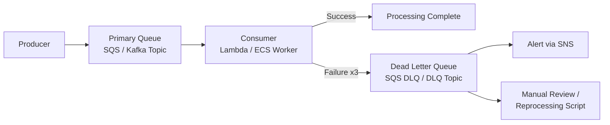
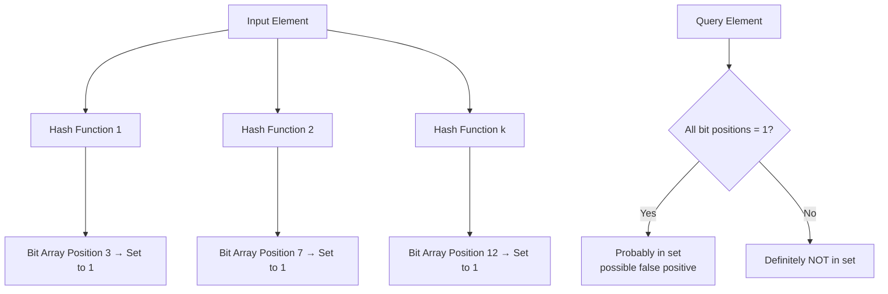
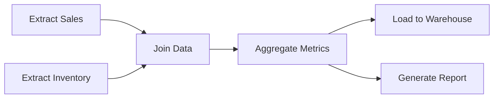
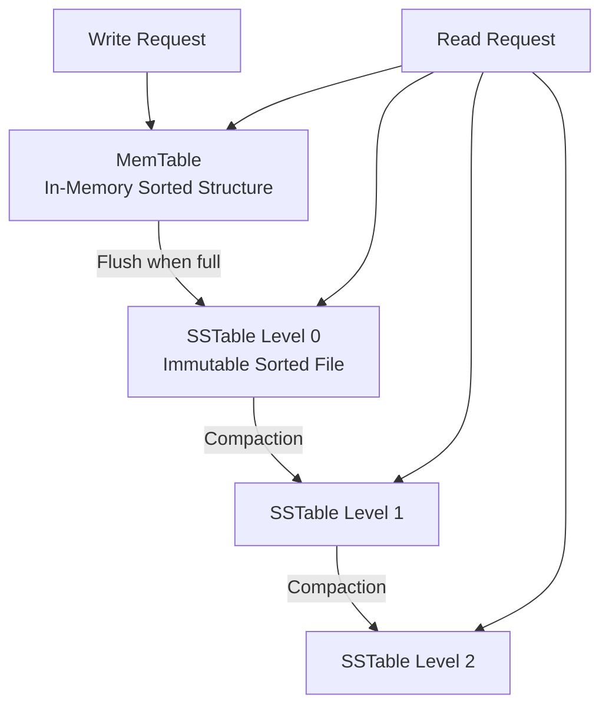
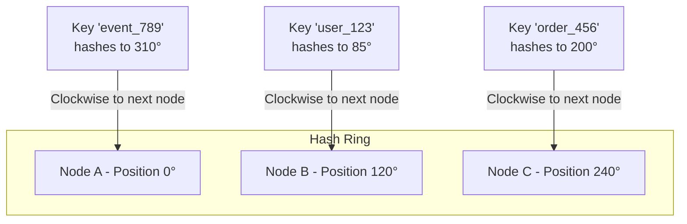

# System Design Data Structures

Data structures in system design are not the typical arrays and linked lists from computer science courses. Instead, they are specialized, distributed structures that solve specific infrastructure problems: deduplication at scale, reliable message delivery, efficient indexing, and workflow orchestration.

---

## 1. Dead Letter Queue (DLQ)

A Dead Letter Queue is a secondary message queue that automatically receives messages that could not be successfully processed by the primary consumer after a configured number of retry attempts.

### How It Works

### Why It Matters
Without a DLQ, a single malformed or "poisoned" message can block an entire queue. The consumer retries indefinitely, creating a bottleneck that prevents all subsequent messages from being processed. A DLQ isolates these failures so the main queue remains healthy.

### AWS Implementation
*   **Amazon SQS:** Every SQS queue can have a DLQ configured via a `RedrivePolicy`. You specify `maxReceiveCount` (e.g., 3), and after that many failed processing attempts, the message is automatically moved to the DLQ.
*   **Amazon MSK (Kafka):** Kafka does not have a native DLQ. You implement it in consumer code by catching exceptions and producing the failed message to a dedicated `*.dlq` topic.

### Key Configuration Decisions
| Parameter | Recommendation | Rationale |
|-----------|---------------|-----------|
| `maxReceiveCount` | 3–5 | Enough retries to handle transient failures, few enough to avoid wasting compute on truly broken messages. |
| DLQ Retention Period | 14 days | Gives the team time to investigate. SQS max is 14 days. |
| DLQ Alarm | CloudWatch Alarm on `ApproximateNumberOfMessagesVisible > 0` | Immediate alert when any message hits the DLQ. |

---

## 2. Bloom Filter

A Bloom Filter is a probabilistic, space-efficient data structure used to test whether an element is a member of a set. It can produce **false positives** (says "maybe yes" when the element is not present) but **never false negatives** (if it says "no," the element is definitively absent).

### How It Works

### Why It Matters
Checking membership in a set of billions of elements (e.g., "Has this URL been crawled?" or "Has this event ID been processed?") using a traditional hash set would require gigabytes of memory. A Bloom Filter can answer the same question using megabytes, at the cost of a small false positive rate.

### Use Cases in Data & AI Engineering
*   **Deduplication in Data Pipelines:** Before inserting a record into a data lake, check a Bloom Filter. If the filter says "definitely not present," insert it. If it says "maybe present," perform the more expensive database lookup. This drastically reduces redundant writes.
*   **Web Crawling:** Avoid re-crawling URLs by checking against a Bloom Filter of already-visited URLs.
*   **Cache Penetration Prevention:** Place a Bloom Filter in front of a cache. If a key is not in the Bloom Filter, you know it won't be in the database either, preventing malicious cache-busting queries.

### Trade-offs
| Aspect | Detail |
|--------|--------|
| **False Positive Rate** | Configurable. Lower rate = more memory and more hash functions. Typical: 1% false positive rate. |
| **Deletion** | Standard Bloom Filters do not support deletion. Use a **Counting Bloom Filter** if removal is needed. |
| **Size** | Fixed at creation. Cannot dynamically resize. Must estimate the expected number of elements upfront. |

---

## 3. Directed Acyclic Graph (DAG)

A DAG is a graph data structure where edges have a direction and there are no cycles (you can never return to a node by following directed edges). In system design, DAGs are the foundational structure for representing workflows and dependency chains.

### Why It Matters
*   **Orchestration:** Apache Airflow, AWS Step Functions, Prefect, and dbt all model workflows as DAGs. Each node is a task, and edges represent dependencies ("Task B must wait for Task A to complete").
*   **Data Lineage:** Data governance tools model lineage as a DAG: Source Table → Transformation → Derived Table → Dashboard. This enables impact analysis ("If I change this column, which dashboards break?").
*   **Dependency Resolution:** Package managers (pip, npm) and build systems (Make, Bazel) use DAGs to determine the correct installation/build order.

### Topological Sort
The key algorithm for DAGs is **topological sorting**, which produces a linear ordering of nodes such that every directed edge `u → v` has `u` appearing before `v`. This is how orchestrators determine task execution order.

**Topological Order:** `Extract Sales` → `Extract Inventory` → `Join Data` → `Aggregate Metrics` → `Load to Warehouse` / `Generate Report`

---

## 4. LSM Tree (Log-Structured Merge Tree)

An LSM Tree is a write-optimized data structure used by databases that prioritize high write throughput. Instead of updating records in-place (like a B-Tree), writes are first buffered in memory (a **MemTable**), then flushed to sorted, immutable files on disk (**SSTables**) and periodically merged/compacted.

### How It Works

### Why It Matters
*   **Used By:** Apache Cassandra, Amazon DynamoDB (internally), RocksDB, InfluxDB, Apache HBase.
*   **Write-Heavy Workloads:** Ideal for logging, time-series, IoT telemetry, and event streaming storage where the write rate is dramatically higher than the read rate.
*   **Trade-off:** Reads are slower because the system must check the MemTable and potentially multiple SSTable levels. This is mitigated by Bloom Filters (checking "is this key in this SSTable?") at each level.

---

## 5. Consistent Hashing

Consistent Hashing is a distributed hashing scheme that minimizes the number of key-to-node reassignments when nodes are added or removed from a cluster. In naive hashing (e.g., `key % N`), adding a single node redistributes almost all keys. Consistent hashing redistributes only `K/N` keys (where K is the total keys and N is the total nodes).

### How It Works

### Why It Matters
*   **Distributed Caching (ElastiCache, Memcached):** When a cache node goes down, consistent hashing ensures only the keys on that node are redistributed, not the entire cache. This prevents a cache stampede.
*   **Data Partitioning (DynamoDB, Cassandra, Kafka):** Determines which partition/node stores a given key. Adding a new partition only moves a fraction of keys.
*   **Load Balancing:** Some load balancers use consistent hashing to route requests to backend servers, ensuring session affinity without sticky sessions.

---

## 6. Merkle Tree (Hash Tree)

A Merkle Tree is a tree structure where every leaf node contains the hash of a data block, and every non-leaf node contains the hash of its children's hashes. This allows efficient and secure verification of data consistency.

### Why It Matters
*   **Data Replication Consistency:** Cassandra and DynamoDB use Merkle Trees during anti-entropy repair. Two replicas exchange only the root hash. If it matches, the data is consistent. If not, they recursively descend the tree to find exactly which data blocks differ, transferring only the inconsistent blocks.
*   **Blockchain:** Every block contains a Merkle Root of all transactions in the block, enabling efficient proof-of-inclusion without downloading the entire block.
*   **Data Pipeline Verification:** After replicating a dataset from S3 to another region, compute the Merkle Root of both copies. If they match, the replication was lossless.

---

## 7. Inverted Index

An Inverted Index maps content (words, tokens, terms) back to the documents that contain them, enabling fast full-text search. Instead of scanning every document for a keyword, you look up the keyword in the index and instantly get a list of matching document IDs.

### How It Works

| Term | Document IDs |
|------|-------------|
| `pipeline` | doc_1, doc_3, doc_7 |
| `kafka` | doc_2, doc_3 |
| `lambda` | doc_1, doc_5, doc_7 |

A search for `"pipeline AND kafka"` intersects the two posting lists: `{doc_3}`.

### Why It Matters
*   **Used By:** Amazon OpenSearch (Elasticsearch), Apache Solr, Amazon Kendra.
*   **Log Aggregation:** Central to how tools like the ELK stack (Elasticsearch-Logstash-Kibana) provide sub-second search across billions of log lines.
*   **RAG Knowledge Bases:** Before vector-based semantic search became dominant, inverted indexes with BM25 scoring were the primary retrieval mechanism. Many production RAG systems use **hybrid search** (inverted index + vector similarity) for optimal relevance.

---

## 8. Vector Index (ANN Index)

A Vector Index is a data structure optimized for Approximate Nearest Neighbor (ANN) search in high-dimensional vector spaces. It enables finding the most similar vectors to a query vector without exhaustively comparing against every vector in the database.

### Common Algorithms
| Algorithm | Used By | Trade-off |
|-----------|---------|-----------|
| **HNSW** (Hierarchical Navigable Small World) | pgvector, OpenSearch, Pinecone | High recall, higher memory usage. Best for accuracy-critical workloads. |
| **IVF** (Inverted File Index) | FAISS, Milvus | Lower memory, requires training step. Good for very large datasets. |
| **ScaNN** (Scalable Nearest Neighbors) | Google Vertex AI | Optimized for quantized vectors. Excellent throughput. |

### Why It Matters
*   **RAG Systems:** The retrieval step in Retrieval-Augmented Generation relies entirely on ANN search. The query is embedded into a vector, and the vector index finds the top-K most similar document chunks.
*   **Recommendation Engines:** User and item embeddings are stored in a vector index. Finding similar items to a user's preference vector is an ANN search.
*   **AWS:** Amazon OpenSearch Serverless (Vector Engine) and Amazon Bedrock Knowledge Bases use HNSW under the hood.

---

## 9. Priority Queue

A Priority Queue is a data structure where each element has an associated priority, and elements are dequeued in priority order rather than FIFO order.

### Why It Matters
*   **Task Scheduling:** Orchestrators use priority queues to ensure critical DAGs run before lower-priority ones when compute resources are constrained.
*   **Rate Limiting:** API gateways can use priority queues to process premium-tier customer requests before free-tier requests during traffic spikes.
*   **Event Processing:** In data pipelines, a priority queue can ensure that "delete" events are processed before "update" events to maintain correct data state.

### AWS Implementation
*   **Amazon SQS FIFO Queues** do not natively support priority. The common pattern is to create multiple queues (`high-priority-queue`, `low-priority-queue`) and have consumers poll high-priority first.

---

## 10. Ring Buffer (Circular Buffer)

A Ring Buffer is a fixed-size buffer that wraps around to the beginning when it reaches the end. Old data is overwritten by new data, making it ideal for scenarios where you only need the most recent N data points.

### Why It Matters
*   **Streaming Ingestion:** Amazon Kinesis Data Streams uses a ring buffer model. Each shard retains records for a configurable retention period (default 24 hours, max 365 days). After retention, old records are automatically discarded.
*   **In-Memory Caching:** Recent LLM conversation history (the "sliding window" context) is essentially a ring buffer: keep the last N messages, drop the oldest when the buffer is full.
*   **Metrics Collection:** CloudWatch agent buffers metrics in a ring buffer before flushing to CloudWatch, smoothing out burst writes.

---

## Summary Table

| Structure | Primary Problem Solved | Key AWS Service |
|-----------|----------------------|-----------------|
| **Dead Letter Queue** | Isolate poisoned messages | Amazon SQS DLQ |
| **Bloom Filter** | Probabilistic set membership at scale | DynamoDB Accelerator (DAX) |
| **DAG** | Workflow dependency ordering | Amazon MWAA (Airflow) |
| **LSM Tree** | High-throughput writes | Amazon DynamoDB (internal) |
| **Consistent Hashing** | Minimal key redistribution on scaling | ElastiCache, DynamoDB |
| **Merkle Tree** | Efficient data consistency verification | DynamoDB (internal replication) |
| **Inverted Index** | Full-text search | Amazon OpenSearch |
| **Vector Index** | Approximate nearest neighbor search | OpenSearch Serverless Vector |
| **Priority Queue** | Priority-ordered processing | Amazon SQS (multi-queue pattern) |
| **Ring Buffer** | Fixed-window recent data retention | Amazon Kinesis Data Streams |
