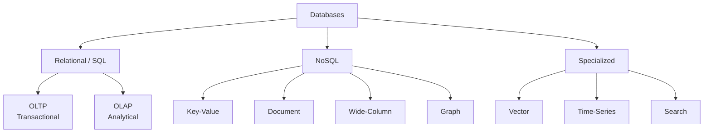
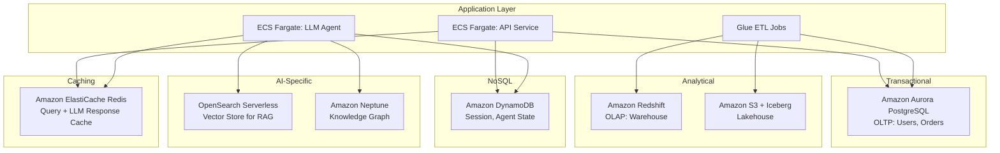

# Database Design in System Design

Choosing the right database is one of the most consequential decisions in system design. The wrong choice leads to performance bottlenecks, scalability ceilings, and expensive migrations. This guide covers the database landscape through the lens of AI and data engineering systems on AWS.

---

## 1. Database Categories

| Category | AWS Service | Optimized For | Example Use Case |
|----------|------------|---------------|------------------|
| **OLTP (Relational)** | Amazon RDS (PostgreSQL, MySQL), Amazon Aurora | Transactional writes, ACID compliance, complex joins | User accounts, orders, financial records |
| **OLAP (Relational)** | Amazon Redshift | Analytical queries over large datasets, aggregations | Business intelligence, warehouse reporting |
| **Key-Value** | Amazon DynamoDB | Single-digit ms reads/writes at any scale, simple access patterns | Session storage, feature flags, agent state |
| **Document** | Amazon DocumentDB (MongoDB-compatible) | Semi-structured JSON documents, flexible schemas | Product catalogs, content management |
| **Wide-Column** | Amazon Keyspaces (Cassandra-compatible) | Massive write throughput, time-series-like access | IoT telemetry, event logs |
| **Graph** | Amazon Neptune | Traversal queries, relationship-heavy data | Fraud detection, knowledge graphs, recommendation |
| **Vector** | Amazon OpenSearch Serverless (Vector), pgvector on RDS | Approximate nearest neighbor search in high dimensions | RAG retrieval, semantic search, recommendations |
| **Time-Series** | Amazon Timestream | Time-ordered data with built-in downsampling | Metrics, sensor data, pipeline SLA tracking |
| **Search** | Amazon OpenSearch | Full-text search, log analytics | Application logs, product search |

---

## 2. ACID vs BASE

These are two consistency models that represent a fundamental trade-off in database design.

### ACID (Relational Databases)
| Property | Meaning |
|----------|---------|
| **Atomicity** | A transaction is all-or-nothing. If any part fails, the entire transaction is rolled back. |
| **Consistency** | A transaction brings the database from one valid state to another. Constraints (foreign keys, unique indexes) are enforced. |
| **Isolation** | Concurrent transactions do not interfere with each other. Each sees a consistent snapshot. |
| **Durability** | Once a transaction is committed, it persists even in the event of a crash. |

**When to Use:** Financial systems, inventory management, any system where data correctness is more important than speed.

### BASE (NoSQL Databases)
| Property | Meaning |
|----------|---------|
| **Basically Available** | The system guarantees availability (responds to every request), even if the response might be stale. |
| **Soft State** | The state of the system may change over time even without new input (due to eventual consistency). |
| **Eventually Consistent** | Given enough time without new writes, all replicas will converge to the same state. |

**When to Use:** Social media feeds, product catalogs, real-time dashboards—systems where high availability and performance are more important than immediate consistency.

---

## 3. CAP Theorem

In a distributed database, you can guarantee at most **two** of the following three properties:

*   **Consistency (C):** Every read receives the most recent write.
*   **Availability (A):** Every request receives a response (not an error), even if it's not the latest data.
*   **Partition Tolerance (P):** The system continues to operate despite network partitions between nodes.

Since network partitions are unavoidable in distributed systems, the real choice is between **CP** (consistent but may reject requests during a partition) and **AP** (available but may serve stale data during a partition).

| Model | AWS Examples | Trade-off |
|-------|-------------|-----------|
| **CP** | RDS (synchronous replication), DynamoDB (strongly consistent reads) | Higher latency, possible unavailability during partitions. |
| **AP** | DynamoDB (eventually consistent reads), ElastiCache | Lower latency, always available, but may serve stale data briefly. |

---

## 4. Scaling Patterns

### Vertical Scaling (Scale Up)
Increase the resources (CPU, RAM, storage) of a single database instance.
*   **AWS:** Change RDS instance class from `db.r6g.large` to `db.r6g.4xlarge`.
*   **Limit:** There's a ceiling — you can't scale a single machine infinitely. Downtime required for resizing (unless Aurora).

### Horizontal Scaling (Scale Out)
Distribute data across multiple database instances.

#### Read Replicas
Create read-only copies of the primary database. Route all read queries to replicas, reducing load on the primary.
*   **AWS:** RDS supports up to 15 read replicas. Aurora supports up to 15 replicas with sub-10ms lag.
*   **Use Case:** Analytics dashboards reading from replicas while the OLTP workload writes to the primary.

#### Sharding (Partitioning)
Split data across multiple independent database instances based on a **shard key** (e.g., `user_id % num_shards`).
*   **Pros:** Nearly unlimited horizontal scale. Each shard handles a fraction of the total traffic.
*   **Cons:** Cross-shard queries are expensive. Operational complexity (managing N databases). Re-sharding is painful.
*   **AWS:** DynamoDB handles sharding (partitioning) automatically and transparently. For RDS, sharding is manual.

---

## 5. Database Selection for Data Engineering

### OLTP vs OLAP

| Dimension | OLTP (RDS/Aurora) | OLAP (Redshift) |
|-----------|-------------------|-----------------|
| **Query Type** | Short, transactional (`INSERT`, single-row `SELECT`) | Complex, analytical (`GROUP BY`, `JOIN`, window functions) |
| **Rows per Query** | One to hundreds | Millions to billions |
| **Schema** | Normalized (3NF) | Denormalized (Star/Snowflake schema) |
| **Indexing** | B-Tree indexes on individual columns | Columnar storage (no traditional indexes) |
| **Concurrency** | Thousands of concurrent transactions | Dozens of concurrent queries |

### Data Lake vs Data Warehouse vs Lakehouse

| Architecture | Storage | Query Engine | AWS Services |
|-------------|---------|-------------|--------------|
| **Data Lake** | S3 (raw files: Parquet, JSON, CSV) | Athena, EMR (Spark) | S3 + Glue Catalog + Athena |
| **Data Warehouse** | Proprietary columnar storage | Dedicated engine | Amazon Redshift |
| **Lakehouse** | S3 with table format (Iceberg, Delta) | Multiple engines | S3 + Iceberg + Athena + Spark |

**Lakehouse** is the modern standard, combining the flexibility and cost of a data lake with the reliability and query performance of a warehouse.

---

## 6. Database Selection for AI Systems

### Vector Databases for RAG
The retrieval step in RAG requires storing document embeddings and performing fast ANN (Approximate Nearest Neighbor) searches.

| Option | AWS Service | Pros | Cons |
|--------|------------|------|------|
| **pgvector** | RDS PostgreSQL + pgvector extension | Use existing PostgreSQL. Combine vector search with relational queries. | Limited scaling for very large vector stores (100M+ vectors). |
| **OpenSearch (Vector)** | OpenSearch Serverless | Fully managed, scales well, supports hybrid search (vector + keyword). | Higher cost. Separate service to manage. |
| **Bedrock KB** | Amazon Bedrock Knowledge Bases | Zero-infrastructure RAG. Handles chunking, embedding, indexing automatically. | Less control over chunking and indexing strategy. |

### Agent State and Memory
*   **Short-Term Memory (Conversation Buffer):** DynamoDB — low-latency key-value lookups by `session_id`.
*   **Long-Term Memory (User Preferences, Facts):** DynamoDB or DocumentDB — store structured user preference documents.
*   **Checkpointing (LangGraph State):** DynamoDB — serialize agent graph state as JSON, keyed by `thread_id + checkpoint_id`.

### Knowledge Graphs
Amazon Neptune (graph database) can store entity-relationship graphs that agents query for structured reasoning:
*   "Which products does Customer X use?" → Traverse `Customer → USES → Product` edges.
*   More structured and deterministic than RAG for factual, relationship-heavy queries.

---

## 7. Indexing Strategies

| Index Type | How It Works | Use Case |
|-----------|-------------|----------|
| **B-Tree** | Balanced tree structure. Efficient for equality and range queries. Default in PostgreSQL/MySQL. | `WHERE user_id = 123`, `WHERE created_at > '2026-01-01'` |
| **Hash** | Direct hash lookup. O(1) for equality queries, useless for ranges. | `WHERE email = 'a@b.com'` (exact match only) |
| **GIN (Generalized Inverted)** | Inverted index for composite types. | Full-text search in PostgreSQL, JSONB querying. |
| **HNSW** | Hierarchical graph for ANN search. | Vector similarity search (pgvector, OpenSearch). |
| **Composite** | Multi-column index. | Queries that filter on multiple columns: `WHERE (tenant_id, created_at)`. |

### Best Practice
*   Index columns that appear in `WHERE`, `JOIN`, and `ORDER BY` clauses.
*   Avoid over-indexing — each index slows down writes and consumes storage.
*   Use `EXPLAIN ANALYZE` to verify that the query planner is actually using your index.

---

## 8. AWS Database Architecture

