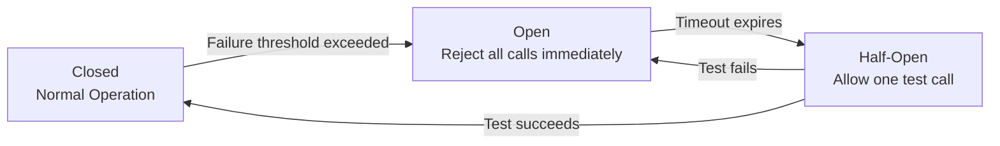
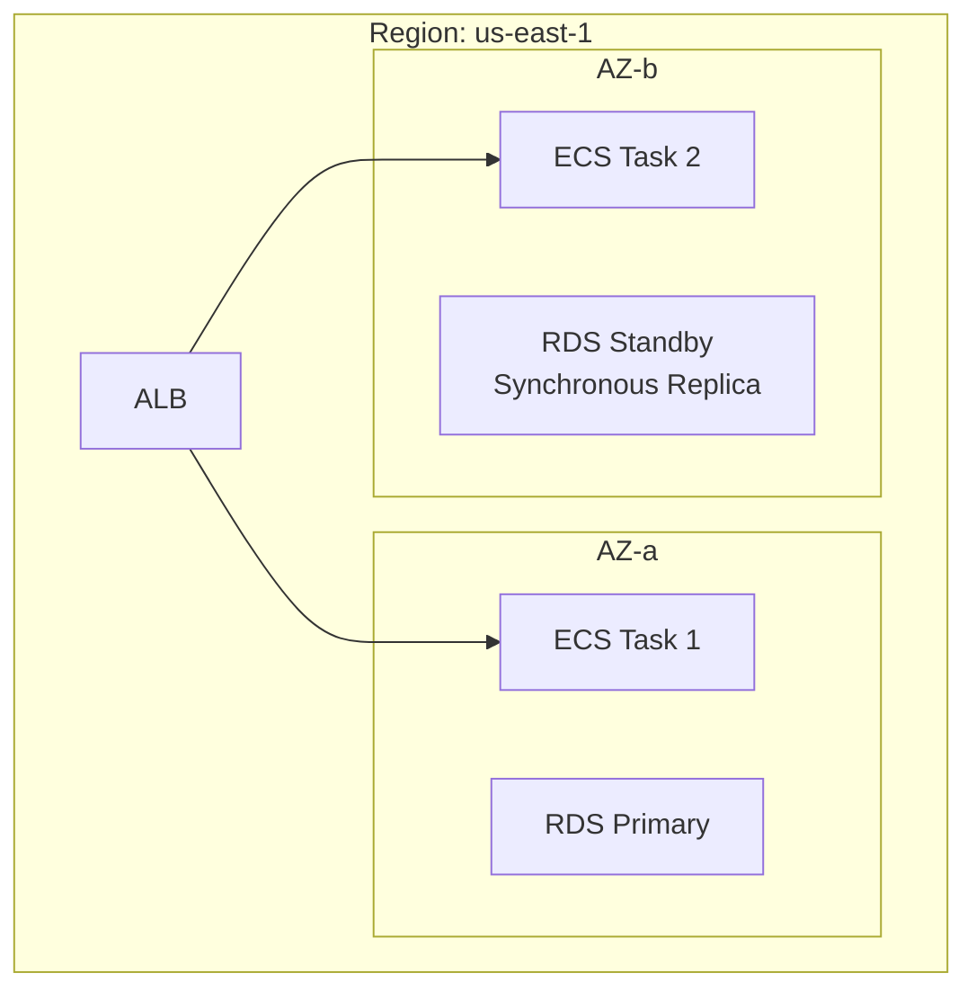
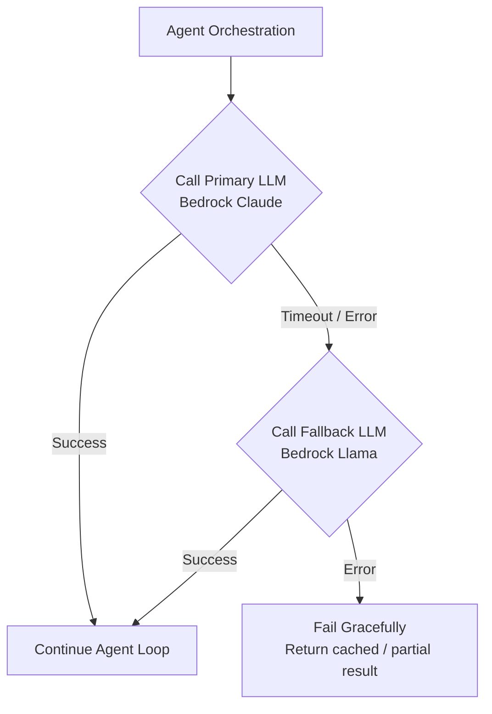

# Fault Tolerance in System Design

Fault tolerance is the ability of a system to continue operating correctly even when one or more of its components fail. In distributed systems, failures are not exceptional — they are expected. Network partitions, hardware degradation, service crashes, and dependency outages are routine. A fault-tolerant system is designed to anticipate, detect, and gracefully recover from these failures without user-visible impact.

---

## 1. Key Principles

### Design for Failure
Assume every component will fail. Design systems so that no single component's failure causes a complete system outage.

### Blast Radius Minimization
Contain failures to the smallest possible scope. A crash in the "notification service" should never cascade into the "payment service."

### Graceful Degradation
When a non-critical dependency fails, the system should continue to serve requests with reduced functionality rather than failing entirely. For example, if the recommendation engine is down, the e-commerce site should still display products (just without personalized recommendations).

---

## 2. Fault Tolerance Patterns

### Retry with Exponential Backoff
When a transient failure occurs (e.g., a network timeout, a 503 response), retry the operation with increasing delays between attempts.

```
Attempt 1: Wait 1 second
Attempt 2: Wait 2 seconds
Attempt 3: Wait 4 seconds
Attempt 4: Wait 8 seconds (give up after max retries)
```

**Add Jitter:** Randomize the delay slightly (e.g., `delay = base * 2^attempt + random(0, 1)`) to prevent a **thundering herd** where all retrying clients reconnect simultaneously.

**AWS Implementation:** AWS SDKs (boto3) have built-in exponential backoff with jitter for API calls. SQS and Lambda have native retry policies.

### Circuit Breaker
A pattern that prevents a service from repeatedly calling a failing dependency. Like an electrical circuit breaker, it "trips" when failures exceed a threshold, immediately rejecting requests instead of wasting resources on calls that will fail.



**States:**
*   **Closed:** All requests pass through to the dependency normally. Failures are counted.
*   **Open:** All requests are immediately rejected (fail-fast) without calling the dependency. An alarm is raised.
*   **Half-Open:** After a cooldown period, one test request is allowed through. If it succeeds, the circuit closes. If it fails, the circuit re-opens.

**Use Case:** An LLM agent calling an external API tool. If the API is down, the circuit breaker trips after 5 failures, and subsequent tool calls immediately return a fallback response instead of adding 30-second timeouts to every agent iteration.

### Bulkhead Pattern
Isolates different parts of a system into independent "compartments" (like bulkheads in a ship) so that a failure in one compartment doesn't flood the entire system.

**Implementation:**
*   **Separate Thread Pools / Connection Pools:** Allocate a dedicated connection pool for each downstream dependency. If the "inventory service" pool is exhausted (because inventory is slow), requests to the "user service" are unaffected because they use a separate pool.
*   **Separate ECS Services:** Deploy each microservice as a separate ECS service with its own scaling policy. A memory leak in Service A doesn't affect Service B.

### Timeout Configuration
Set explicit timeouts for every external call (HTTP requests, database queries, LLM invocations). Without timeouts, a slow dependency can consume all available threads/connections, causing cascading failures.

**Guidelines:**
*   Database queries: 5–10 seconds.
*   Internal API calls: 3–5 seconds.
*   LLM inference: 30–120 seconds (model-dependent; set aggressively).
*   Always set a timeout shorter than the caller's timeout to prevent cascading.

### Idempotency
An operation is idempotent if performing it multiple times has the same effect as performing it once. This is critical for safety during retries.

**Example:** Processing a payment. If the consumer crashes after deducting the payment but before sending the acknowledgment, the message will be retried. Without idempotency, the customer is charged twice.

**Implementation:** Use an **idempotency key** (e.g., `order_id`). Before processing, check if this key has already been processed. If yes, return the cached result. If no, process and record the key.

**AWS:** DynamoDB's `PutItem` with a condition expression (`attribute_not_exists(pk)`) guarantees idempotent writes.

---

## 3. Redundancy and Replication

### Multi-AZ (Availability Zone) Deployment
Deploy resources across at least two Availability Zones within a region. If an entire AZ experiences a failure (power outage, network issue), the application continues to run in the remaining AZs.



*   **RDS Multi-AZ:** Automatic synchronous replication to a standby in another AZ. Automatic failover (< 60 seconds) if the primary fails.
*   **ECS/Fargate:** Spread tasks across multiple AZs using the `spread` placement strategy.
*   **S3:** Automatically replicates objects across at least 3 AZs within a region (11 nines of durability).

### Multi-Region Deployment
For disaster recovery (DR) or global latency optimization, deploy across multiple AWS regions.

| DR Strategy | RPO | RTO | Cost | Description |
|------------|-----|-----|------|-------------|
| **Backup & Restore** | Hours | Hours | $ | Backups in S3 cross-region. Rebuild infrastructure from IaC on failure. |
| **Pilot Light** | Minutes | Minutes | $$ | Core infrastructure (DB replicas) always running in DR region. Scale up compute on failure. |
| **Warm Standby** | Seconds | Minutes | $$$ | A scaled-down version of the full production stack always running in DR region. Scale up on failure. |
| **Active-Active** | ~0 | ~0 | $$$$ | Full production stack in both regions, serving live traffic. Route 53 failover routing. |

---

## 4. Fault Tolerance in Data Pipelines

### Checkpointing
Save the state of a long-running pipeline at regular intervals. On failure, resume from the last checkpoint instead of restarting from scratch.
*   **Spark (Glue/EMR):** Spark Structured Streaming supports checkpointing to S3 for exactly-once processing.
*   **Kinesis (KCL):** The Kinesis Client Library checkpoints shard iterator positions to DynamoDB.

### Dead Letter Queues (DLQs)
Isolate failed records so that one bad record doesn't block the entire pipeline. See **Data Structures** guide for details.

### Idempotent Writes
Design pipeline stages to be safely re-runnable:
*   **Overwrite Partition:** Each run writes to a date-partitioned S3 prefix (`s3://bucket/table/date=2026-04-17/`). Re-running overwrites the same partition, producing identical results.
*   **Upsert (MERGE):** In Redshift or DynamoDB, use upsert logic: insert if the key doesn't exist, update if it does.

### Pipeline SLAs and Alerting
*   Define an SLA for when the pipeline must complete (e.g., "sales_fact table must be updated by 6 AM EST").
*   Use Airflow's `sla` parameter on DAGs. If the DAG misses the SLA, it triggers an email/Slack notification.
*   Set CloudWatch Alarms on custom metrics like `pipeline_duration_seconds` and `rows_processed`.

---

## 5. Fault Tolerance in AI Systems

### LLM Provider Fallback
If the primary LLM provider (e.g., Bedrock Claude) is down or rate-limited, automatically route to a secondary provider. Implement this as a try/except in the agent orchestration layer.



### Agent Loop Termination
Without a maximum iteration limit, an agent can enter an infinite loop (tool call fails → agent retries → fails → retries forever), consuming unlimited tokens and compute.

**Mitigations:**
*   Set a `max_iterations` limit on the agent loop (e.g., 25 iterations).
*   Set a `max_tokens_budget` per agent run. If cumulative tokens exceed the budget, terminate.
*   Set a `max_wall_clock_time` (e.g., 5 minutes). Terminate if exceeded.

### Deterministic Fallback for Agentic Pipelines
If an agent in a data pipeline fails to produce a valid transformation, fall back to a hardcoded, deterministic rule. The pipeline must never fully depend on LLM availability.

---

## 6. Chaos Engineering

Chaos engineering is the discipline of proactively injecting failures into a system to verify that fault tolerance mechanisms work as expected *before* a real outage occurs.

### Principles
1.  Define the system's steady state (e.g., "p99 latency < 200ms, error rate < 0.1%").
2.  Hypothesize that the steady state will hold during a failure.
3.  Inject a real-world failure (kill an ECS task, throttle a DynamoDB table, block network to Bedrock).
4.  Observe whether the system maintains steady state.
5.  Fix any weaknesses discovered.

### AWS Fault Injection Service (FIS)
Managed chaos engineering service that creates experiments to inject failures:
*   **Stop/Terminate ECS tasks** to test container recovery.
*   **Throttle DynamoDB reads/writes** to test circuit breakers and fallback paths.
*   **Inject CPU/Memory stress** on EC2 instances to test auto-scaling.
*   **Disrupt network connectivity** to test multi-AZ failover.

---

## 7. Summary Checklist

| ✅ Practice | Applied To |
|------------|-----------|
| Retry with exponential backoff + jitter | All external API/LLM calls |
| Circuit breaker | High-risk external dependencies |
| Timeouts on every call | HTTP clients, DB connections, LLM calls |
| Idempotent operations | Payment processing, pipeline writes |
| Dead Letter Queues | SQS consumers, Kinesis processors |
| Multi-AZ deployment | ECS, RDS, ElastiCache |
| Checkpointing | Streaming pipelines, agent state |
| Max iteration / token budget limits | LLM agent loops |
| LLM provider fallback | Agent orchestration |
| Chaos engineering (AWS FIS) | Quarterly game days |
