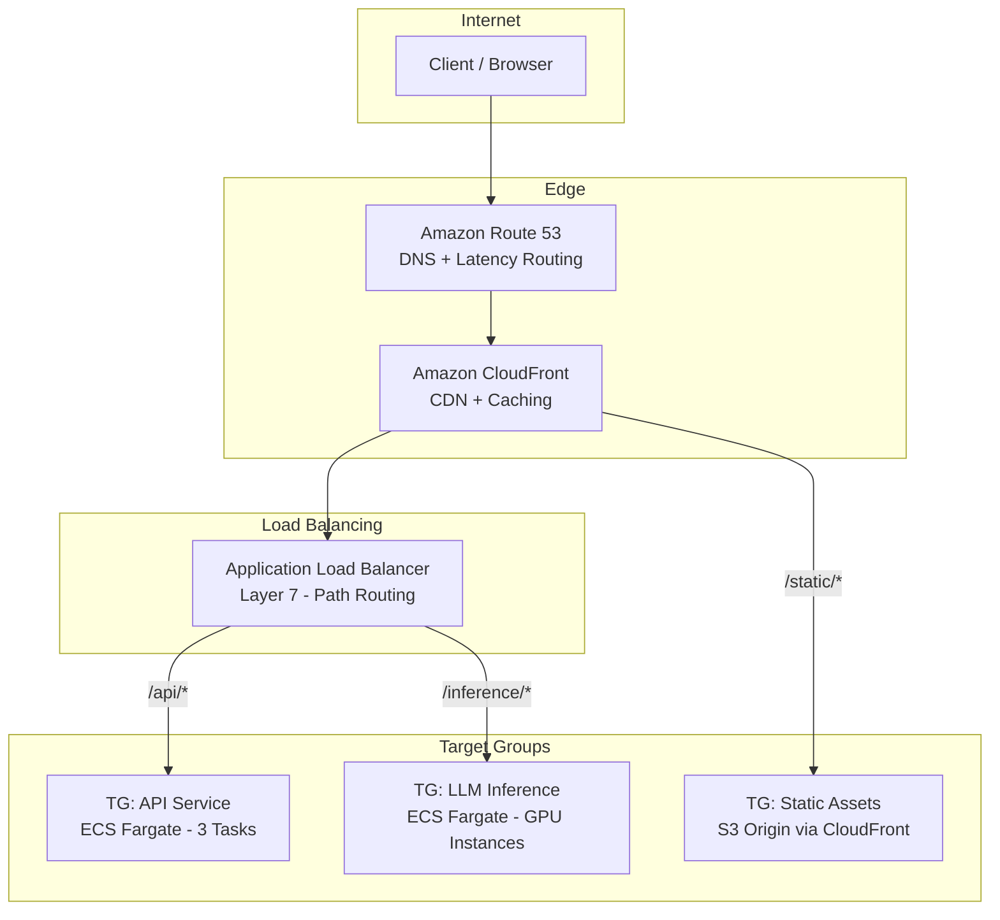

# Load Balancing in System Design

Load balancing is the process of distributing incoming network traffic or workload across multiple servers, containers, or workers to ensure no single resource is overwhelmed. It is a foundational building block for achieving high availability, scalability, and fault tolerance in distributed systems.

---

## 1. Why Load Balancing Matters

Without load balancing, a single server handles all traffic. When that server goes down, the entire application goes down. When traffic spikes, that server becomes a bottleneck. Load balancing solves both problems:

*   **High Availability:** If one backend instance fails, the load balancer routes traffic to healthy instances.
*   **Horizontal Scalability:** Add more instances behind the load balancer to handle more traffic, without changing the client.
*   **Efficient Resource Utilization:** Distribute work evenly so no single instance is over- or under-utilized.

---

## 2. Types of Load Balancers

### Layer 4 (Transport Layer) Load Balancing
Operates at the TCP/UDP layer. Routes traffic based on IP address and port number. It does not inspect the content of the request (no HTTP headers, no URL path).

*   **Speed:** Extremely fast because it doesn't parse application-level data.
*   **Use Case:** High-throughput, low-latency routing for database connections, gRPC streams, or game servers.
*   **AWS:** Network Load Balancer (NLB).

### Layer 7 (Application Layer) Load Balancing
Operates at the HTTP/HTTPS layer. Can inspect request content (URL path, headers, cookies, query parameters) and make intelligent routing decisions.

*   **Flexibility:** Can route `/api/*` to one target group and `/static/*` to another. Can perform header-based routing for A/B testing.
*   **Use Case:** Web applications, REST APIs, microservices routing.
*   **AWS:** Application Load Balancer (ALB).

### Comparison

| Feature | NLB (Layer 4) | ALB (Layer 7) |
|---------|---------------|---------------|
| **Protocol** | TCP, UDP, TLS | HTTP, HTTPS, gRPC |
| **Routing Logic** | IP + Port | URL path, Host header, HTTP method, query string |
| **Performance** | Millions of requests/sec, ultra-low latency | Hundreds of thousands of requests/sec |
| **SSL Termination** | Optional (TLS passthrough supported) | Yes (terminates at ALB) |
| **WebSocket Support** | Yes | Yes |
| **Static IP** | Yes (Elastic IPs) | No (use Global Accelerator for static IP) |
| **Best For** | TCP services, extreme throughput | HTTP APIs, microservices, path-based routing |

---

## 3. Load Balancing Algorithms

The algorithm determines *how* the load balancer selects which backend instance receives the next request.

### Round Robin
Requests are distributed sequentially across all healthy instances in a circular order: Instance 1 → 2 → 3 → 1 → 2 → 3 → ...

*   **Pros:** Simple, fair distribution when all instances are identical.
*   **Cons:** Ignores instance health/load. If Instance 2 is slow, it still gets the same share of traffic.

### Weighted Round Robin
Same as Round Robin, but each instance has a weight. An instance with weight 3 receives 3x more requests than an instance with weight 1.

*   **Use Case:** Canary deployments—route 5% of traffic to the new version (weight 1) and 95% to the old version (weight 19).

### Least Connections
Routes the next request to the instance with the fewest active connections.

*   **Pros:** Naturally adapts to instances with different processing speeds. Faster instances complete requests sooner, free up connections, and thus receive more requests.
*   **Use Case:** Applications with long-lived connections or variable request processing times (e.g., LLM inference endpoints where some prompts take 2s and others take 30s).

### Least Response Time
Routes to the instance with the lowest average response time *and* fewest active connections.

*   **Pros:** Most intelligent routing for latency-sensitive applications.
*   **Cons:** Requires the load balancer to continuously measure response times, adding slight overhead.

### IP Hash
Hashes the client's IP address to deterministically select a backend instance. The same client IP always routes to the same instance.

*   **Use Case:** Stateful applications that require session affinity (sticky sessions) without using cookies.
*   **Risk:** Uneven distribution if a large share of traffic comes from a small number of IPs (e.g., corporate NATs).

### Consistent Hashing
See the **Data Structures** guide for details. Used for distributed caching and stateful routing where minimal redistribution on scaling events is critical.

---

## 4. Health Checks

A load balancer must know which backend instances are healthy. It does this via periodic health checks.

### Configuration Parameters
| Parameter | Description | Typical Value |
|-----------|------------|---------------|
| **Health Check Path** | The HTTP endpoint to probe (Layer 7). | `/health` or `/api/health` |
| **Protocol** | HTTP, HTTPS, or TCP. | HTTP |
| **Interval** | How often to check (seconds). | 30 seconds |
| **Timeout** | Max time to wait for a response before marking unhealthy. | 5 seconds |
| **Healthy Threshold** | Consecutive successful checks to mark an instance healthy. | 3 |
| **Unhealthy Threshold** | Consecutive failed checks to mark an instance unhealthy. | 2 |

### Best Practice
Implement a `/health` endpoint in your application that checks critical dependencies (database connectivity, cache availability) and returns:
*   `200 OK` with `{"status": "healthy"}` if everything is operational.
*   `503 Service Unavailable` if a critical dependency is down. The load balancer will stop routing traffic to this instance.

---

## 5. Load Balancing Patterns for AI & Data Engineering

### LLM Inference Endpoint Load Balancing
*   **Challenge:** LLM inference requests have highly variable latency (a 10-token prompt vs. a 4000-token prompt). Round Robin performs poorly.
*   **Solution:** Use **Least Connections** or **Least Response Time** algorithms via an ALB to naturally route shorter requests to instances that free up faster.
*   **AWS:** ALB in front of ECS Fargate tasks running vLLM or TGI (Text Generation Inference) containers.

### Data Pipeline Worker Distribution
*   **Challenge:** An orchestrator (Airflow/Prefect) needs to distribute tasks across a pool of worker nodes.
*   **Solution:** Workers pull tasks from a queue (SQS) rather than the orchestrator pushing to them. This is a **pull-based load balancing** pattern. Each worker processes at its own pace, naturally balancing load.

### Multi-Model Routing
*   **Challenge:** Route different types of AI requests to different model endpoints (simple queries → small model, complex queries → large model).
*   **Solution:** Use ALB path-based routing: `/api/inference/small` → ECS target group running Llama 3 8B, `/api/inference/large` → ECS target group running Claude Sonnet.

---

## 6. AWS Load Balancing Architecture

### Key AWS Services
| Service | Role |
|---------|------|
| **Route 53** | DNS-level load balancing (latency-based, geolocation, failover routing). |
| **CloudFront** | CDN that caches static content at edge locations, reducing origin load. |
| **ALB** | Application-layer routing with path, host, and header-based rules. |
| **NLB** | Transport-layer routing for TCP/gRPC with static IPs and ultra-low latency. |
| **Global Accelerator** | Routes traffic through AWS's global network for consistent low latency. Provides static Anycast IPs. |
| **ECS Service Auto Scaling** | Automatically adjusts the number of ECS tasks in a target group based on ALB request count or CPU utilization. |
