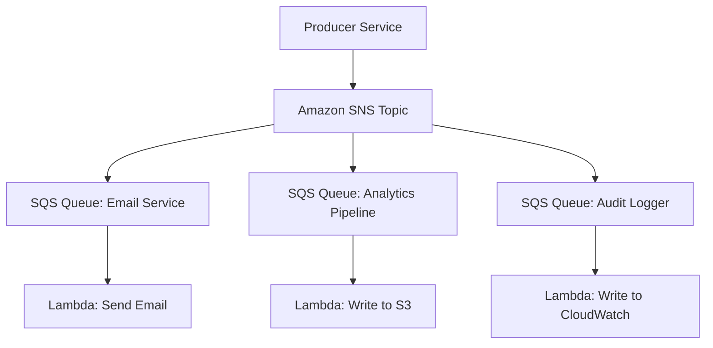
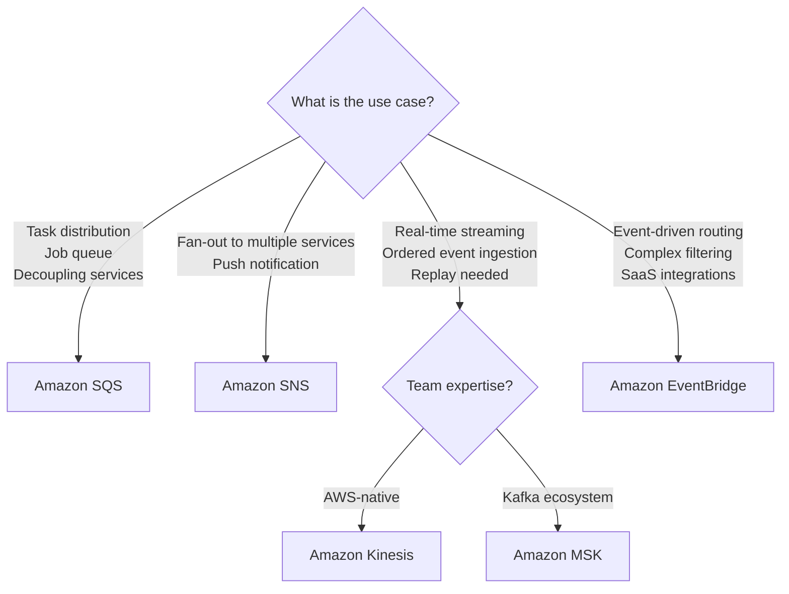
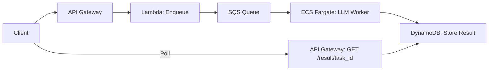
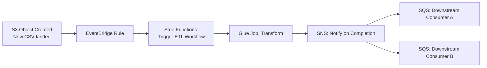
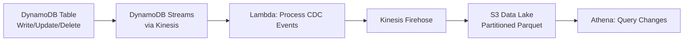

# Message Queues and Event Streaming in System Design

Asynchronous communication is a cornerstone of distributed systems. Instead of one service directly calling another and waiting for a response (synchronous / tightly coupled), services communicate by publishing messages to an intermediary (a queue or a stream), which the consuming service reads at its own pace. This decoupling is essential for building resilient, scalable AI and data engineering systems.

---

## 1. Message Queue vs Event Stream

These are two distinct patterns that solve different problems:

| Aspect | Message Queue | Event Stream |
|--------|--------------|--------------|
| **Model** | Point-to-point. A message is consumed by exactly one consumer, then removed from the queue. | Pub/Sub with retention. Messages are published to a log that multiple consumers can independently read. Messages are retained for a configurable duration. |
| **Consumer Model** | Competing consumers (workers pull from the same queue). | Consumer groups with independent offsets (each group tracks its own position in the stream). |
| **Ordering** | FIFO within a single queue (SQS FIFO). Standard queues offer best-effort ordering. | Strict ordering within a partition/shard. |
| **Replayability** | No. Once consumed, the message is gone. | Yes. Consumers can rewind their offset and re-read old messages. |
| **AWS Service** | Amazon SQS | Amazon Kinesis Data Streams, Amazon MSK (Kafka) |
| **Use Case** | Task distribution, job queues, decoupling microservices. | Real-time data ingestion, event sourcing, change data capture (CDC). |

---

## 2. Amazon SQS (Simple Queue Service)

A fully managed, serverless message queue.

### Variants

| Feature | SQS Standard | SQS FIFO |
|---------|-------------|----------|
| **Throughput** | Nearly unlimited | 3,000 msg/sec with batching |
| **Ordering** | Best-effort | Strict FIFO within Message Group |
| **Delivery** | At-least-once (possible duplicates) | Exactly-once processing |
| **Use Case** | High-volume, order-insensitive workloads | Financial transactions, sequential task processing |

### Key Concepts
*   **Visibility Timeout:** When a consumer reads a message, it becomes invisible to other consumers for a configured duration. If the consumer processes it successfully and deletes it, it's gone. If the consumer crashes, the message becomes visible again for another consumer to pick up. This provides **at-least-once delivery**.
*   **Dead Letter Queue (DLQ):** After `maxReceiveCount` failed processing attempts, the message is moved to a DLQ for investigation.
*   **Long Polling:** Set `WaitTimeSeconds > 0` to have the consumer wait for messages rather than repeatedly polling an empty queue, reducing API costs.

### Architecture Pattern: Fan-Out with SNS + SQS

A single event (e.g., "Order Placed") is published to an SNS topic and fanned out to multiple SQS queues, each processed by a different service independently.

---

## 3. Amazon Kinesis Data Streams

A real-time event streaming service for high-throughput, ordered data ingestion.

### Key Concepts
*   **Shard:** The unit of throughput. Each shard supports 1 MB/sec writes and 2 MB/sec reads. Scale by adding shards.
*   **Partition Key:** Determines which shard a record is routed to (via hash). Records with the same partition key go to the same shard, guaranteeing ordering for that key.
*   **Retention Period:** Records are retained for 24 hours by default (extendable to 365 days). Consumers can replay from any point within the retention window.
*   **Enhanced Fan-Out:** Dedicated 2 MB/sec read throughput per consumer, avoiding the shared read limit when multiple consumers read from the same shard.

### Use Cases in Data Engineering
*   **Clickstream Ingestion:** Website events are published to Kinesis with `user_id` as the partition key. A Lambda consumer enriches events and writes to S3 via Firehose.
*   **IoT Sensor Data:** Millions of IoT devices publish telemetry. Kinesis ingests at scale, and Kinesis Data Analytics runs real-time SQL/Flink jobs for anomaly detection.
*   **Change Data Capture (CDC):** DynamoDB Streams (backed by Kinesis) captures every insert, update, and delete on a DynamoDB table and streams it to downstream consumers.

---

## 4. Amazon MSK (Managed Streaming for Apache Kafka)

AWS-managed Apache Kafka for teams that need Kafka's ecosystem (Kafka Connect, Kafka Streams, Schema Registry) with reduced operational overhead.

### When to Choose Kafka (MSK) Over Kinesis

| Consideration | Choose Kinesis | Choose MSK (Kafka) |
|---------------|---------------|-------------------|
| **Operational Overhead** | Serverless, zero management | Requires cluster sizing, broker management |
| **Ecosystem** | AWS-native integrations | Rich Kafka ecosystem (Connect, Streams, ksqlDB) |
| **Message Size** | Max 1 MB per record | Default 1 MB, configurable up to 10 MB+ |
| **Consumer Flexibility** | Limited consumer group model | Full Kafka consumer group protocol |
| **Team Expertise** | Team is AWS-native | Team has Kafka expertise |
| **Cost at Scale** | Can be expensive at very high throughput | More cost-effective for very large, sustained workloads |

---

## 5. Amazon SNS (Simple Notification Service)

A fully managed pub/sub messaging service for push-based fan-out.

### Key Patterns
*   **SNS + SQS (Fan-Out):** Publish once, deliver to many queues (see diagram above).
*   **SNS + Lambda:** Trigger a Lambda function directly on message publish.
*   **SNS + HTTP/HTTPS:** Push notifications to external webhook endpoints.
*   **SNS Filtering:** Apply message filter policies so each subscriber only receives messages matching certain attributes (e.g., `event_type = "order_placed"`), avoiding having subscribers discard irrelevant messages.

---

## 6. Amazon EventBridge

A serverless event bus for event-driven architectures. While SNS is a simple pub/sub service, EventBridge is an intelligent event router with content-based filtering, schema registry, and native integrations with 100+ AWS services and SaaS providers.

### Key Advantages Over SNS
*   **Content-Based Routing:** Route events based on any field in the event body, not just message attributes.
*   **Schema Registry:** Automatically discovers and stores event schemas for documentation and code generation.
*   **Archive and Replay:** Archive events and replay them for debugging or backfilling.
*   **Built-in SaaS Integrations:** Natively receives events from Shopify, Zendesk, Auth0, etc.

### Use Case
An agentic system publishes structured events to EventBridge: `{"source": "agent.tool", "detail-type": "tool_call_completed", "detail": {"tool": "sql_query", "status": "success", "duration_ms": 450}}`. EventBridge rules route success events to a metrics Lambda and failure events to an alerting Lambda.

---

## 7. Choosing the Right Service

---

## 8. Patterns for AI and Data Engineering

### Async LLM Processing Queue
For AI applications where LLM inference is slow (seconds to minutes), use SQS to decouple the API from inference:

The API immediately returns a `task_id`. The LLM worker processes the queue at its own pace. The client polls for the result.

### Event-Driven Data Pipeline

No polling, no cron jobs. The pipeline is triggered by the event of new data arriving in S3.

### Streaming CDC Pipeline

Every change to the DynamoDB table is captured as a stream event, processed, and written to the data lake for historical analysis.
