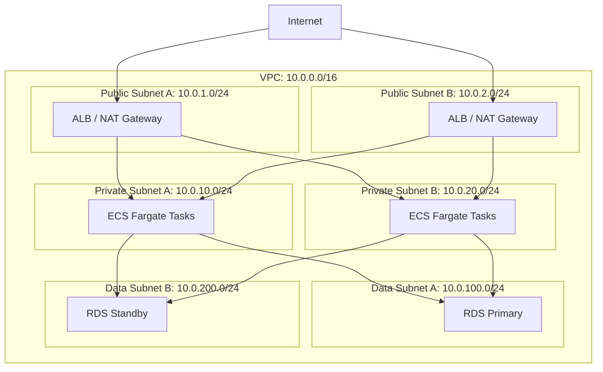
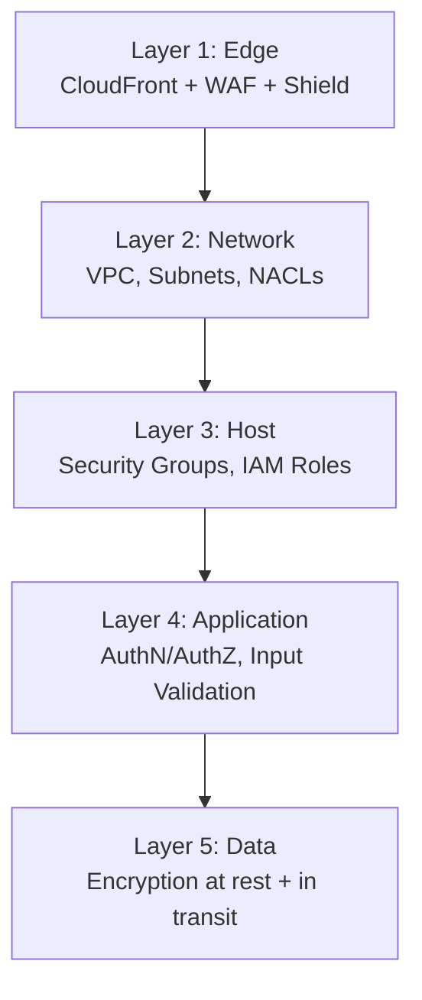
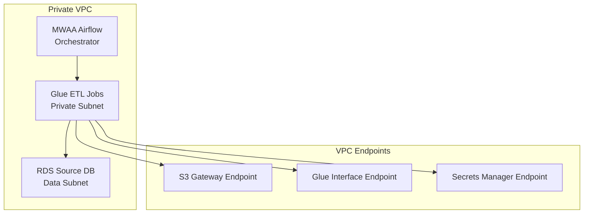

# Networking and Security in System Design

Networking is the connective tissue of every distributed system — it determines how services communicate, how users reach your application, and how data flows between components. Security ensures that this communication is authenticated, authorized, encrypted, and auditable. These two topics are inseparable in production system design.

---

## 1. AWS Networking Fundamentals

### VPC (Virtual Private Cloud)
A logically isolated section of AWS where you launch resources in a virtual network that you define. Every production resource should live inside a VPC.



### Key Networking Components

| Component | Purpose | AWS Service |
|-----------|---------|-------------|
| **Subnet** | A range of IP addresses within a VPC. Public subnets have a route to an Internet Gateway; private subnets do not. | VPC Subnets |
| **Internet Gateway (IGW)** | Allows resources in public subnets to communicate with the public internet. | VPC IGW |
| **NAT Gateway** | Allows resources in private subnets to initiate outbound connections to the internet (e.g., to download packages) without being directly reachable from the internet. | VPC NAT Gateway |
| **Security Group** | A stateful firewall at the resource level (ENI). Define inbound/outbound rules by protocol, port, and source/destination. | VPC Security Groups |
| **Network ACL (NACL)** | A stateless firewall at the subnet level. Provides a second layer of defense. | VPC NACLs |
| **VPC Endpoint** | A private connection between your VPC and an AWS service (S3, DynamoDB, Bedrock) that does not traverse the public internet. | VPC Endpoints |
| **VPC Peering** | A networking connection between two VPCs that enables routing traffic between them using private IP addresses. | VPC Peering |
| **Transit Gateway** | A central hub that connects multiple VPCs and on-premises networks. | AWS Transit Gateway |

### VPC Endpoints (Critical for Data & AI)
VPC Endpoints are essential for keeping data traffic private:
*   **Gateway Endpoint:** Free. Available for S3 and DynamoDB. Add a route in the subnet route table.
*   **Interface Endpoint (PrivateLink):** Creates an ENI in your subnet with a private IP. Available for Bedrock, Secrets Manager, CloudWatch, SQS, Kinesis, and 100+ services.

**Why It Matters:** Without VPC Endpoints, an ECS task in a private subnet calling the Bedrock API would need to route through a NAT Gateway → Internet Gateway → public Bedrock endpoint, incurring NAT Gateway data processing charges and exposing data to the public internet.

---

## 2. DNS and Content Delivery

### Amazon Route 53 (DNS)
Managed DNS service with advanced routing policies:

| Routing Policy | Behavior | Use Case |
|---------------|----------|----------|
| **Simple** | Single record, single destination. | Single-region, simple apps. |
| **Weighted** | Distribute traffic by percentage. | Canary deployments (5% to new version). |
| **Latency-Based** | Route to the region with lowest latency. | Multi-region deployments. |
| **Failover** | Route to primary; if unhealthy, route to secondary. | Active-passive disaster recovery. |
| **Geolocation** | Route based on user's geographic location. | Data residency compliance (EU users → EU region). |

### Amazon CloudFront (CDN)
A Content Delivery Network that caches content at 450+ edge locations worldwide:
*   **Static Assets:** Cache JS, CSS, images close to users for sub-50ms load times.
*   **API Acceleration:** Use CloudFront in front of API Gateway to reduce latency for geographically distributed users.
*   **DDoS Protection:** CloudFront integrates with AWS Shield Standard (free, automatic L3/L4 DDoS protection) and AWS Shield Advanced (paid, L7 protection).

---

## 3. Security Fundamentals

### Defense in Depth
Security is applied at every layer, not just at the perimeter:



### IAM (Identity and Access Management)
The foundation of AWS security. Controls *who* can do *what* on *which* resources.

**Core Principles:**
*   **Least Privilege:** Grant only the permissions required to perform a specific task. Never use `Action: "*"` or `Resource: "*"` in production.
*   **IAM Roles over IAM Users:** For services (ECS tasks, Lambda functions, Glue jobs), use IAM Roles attached to the resource — never embed long-lived access keys.
*   **Condition Keys:** Restrict policies with conditions: `"Condition": {"IpAddress": {"aws:SourceIp": "10.0.0.0/16"}}` to limit access to VPC-internal requests only.

**Example: Least Privilege for a Glue ETL Job**
```json
{
  "Effect": "Allow",
  "Action": [
    "s3:GetObject",
    "s3:ListBucket"
  ],
  "Resource": [
    "arn:aws:s3:::source-bucket",
    "arn:aws:s3:::source-bucket/*"
  ]
},
{
  "Effect": "Allow",
  "Action": [
    "s3:PutObject"
  ],
  "Resource": [
    "arn:aws:s3:::target-bucket/silver/*"
  ]
}
```
The Glue job can only read from the source bucket and write to the `silver/` prefix of the target bucket. Nothing else.

### Encryption

| Type | Meaning | AWS Implementation |
|------|---------|-------------------|
| **At Rest** | Data is encrypted when stored on disk. | S3 SSE-S3 / SSE-KMS, RDS encryption, EBS encryption. |
| **In Transit** | Data is encrypted while moving over the network. | TLS 1.2+ on ALB, HTTPS enforcement via S3 bucket policies. |
| **Client-Side** | Data is encrypted before it leaves the client, and the server never sees the plaintext. | AWS Encryption SDK, S3 client-side encryption. |

**AWS KMS (Key Management Service):**
*   Centrally manages encryption keys.
*   Supports automatic key rotation.
*   Audit key usage via CloudTrail.
*   Use **Customer Managed Keys (CMKs)** for sensitive workloads where you need control over key policies.

### Secrets Management
**AWS Secrets Manager:**
*   Stores API keys, database credentials, LLM provider tokens.
*   Supports automatic rotation (e.g., rotate RDS credentials every 30 days).
*   ECS tasks and Lambda functions retrieve secrets at runtime via IAM role, never baking secrets into container images or environment variables.

---

## 4. Security for AI Systems

### Prompt Injection Defense
Malicious users craft inputs that manipulate the LLM into ignoring its system prompt or executing unauthorized actions.

**Mitigations:**
*   **Amazon Bedrock Guardrails:** Configure content filters, topic restrictions, and PII detection that run before and after every LLM invocation.
*   **Input Validation Lambda:** A pre-processing step that scans user input for known injection patterns (e.g., "ignore previous instructions") before passing it to the LLM.
*   **Output Validation:** Validate LLM-generated tool calls against an allowlist of permitted tools and parameter schemas.

### PII Protection in Data Pipelines
*   **Amazon Macie:** Automatically scans S3 buckets for PII (credit card numbers, SSNs, email addresses) and alerts.
*   **Amazon Comprehend:** NLP-based entity detection that can identify and redact PII in text data flowing through a pipeline.
*   **Column-Level Encryption:** Encrypt sensitive columns (e.g., `email`, `ssn`) in Redshift using KMS before analysts can query them. Use Lake Formation to grant decryption access to authorized roles only.

### Model Access Control
*   Use IAM policies to control which roles can invoke specific Bedrock models:
    ```json
    {
      "Effect": "Allow",
      "Action": "bedrock:InvokeModel",
      "Resource": "arn:aws:bedrock:us-east-1::foundation-model/anthropic.claude-3-5-sonnet-*"
    }
    ```
*   This prevents unauthorized services or users from invoking expensive models.

---

## 5. Security for Data Engineering

### Data Access Governance with Lake Formation
AWS Lake Formation provides centralized, fine-grained access control across the data lake:

*   **Database-Level Permissions:** "Data Engineer role can create tables in the `silver` database."
*   **Table-Level Permissions:** "Analyst role can SELECT from `gold.sales_fact`."
*   **Column-Level Permissions:** "Marketing role can SELECT all columns from `gold.customers` EXCEPT `ssn` and `credit_card`."
*   **Row-Level Security:** "EU Analyst role can only see rows WHERE `region = 'EU'`."

### Network Isolation for Pipelines



*   No component has a public IP or internet access.
*   All AWS service communication flows through VPC Endpoints.
*   Glue jobs retrieve database credentials from Secrets Manager via PrivateLink.

---

## 6. Compliance and Auditing

| Requirement | AWS Service | What It Does |
|------------|-------------|-------------|
| **API Audit Trail** | AWS CloudTrail | Logs every AWS API call (who did what, when, from where). |
| **Configuration Compliance** | AWS Config | Detects configuration drift (e.g., "this S3 bucket is now public"). |
| **Data Access Auditing** | Lake Formation + CloudTrail | Logs which IAM role queried which table and column. |
| **Network Flow Logs** | VPC Flow Logs | Records all IP traffic in/out of VPC network interfaces. |
| **Threat Detection** | Amazon GuardDuty | ML-based detection of unusual API calls, compromised credentials, and crypto-mining. |
