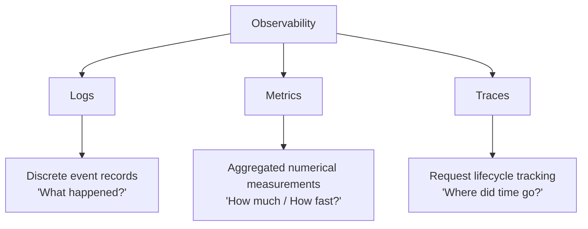
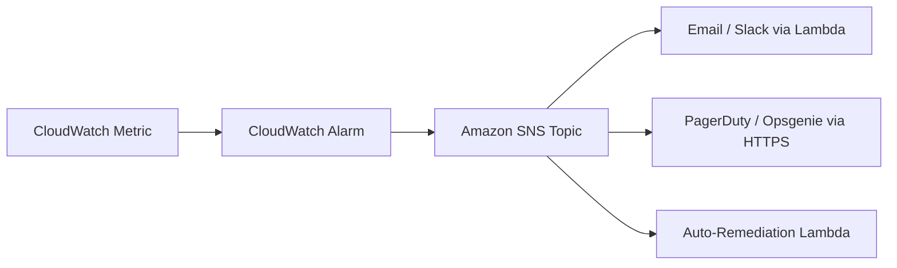
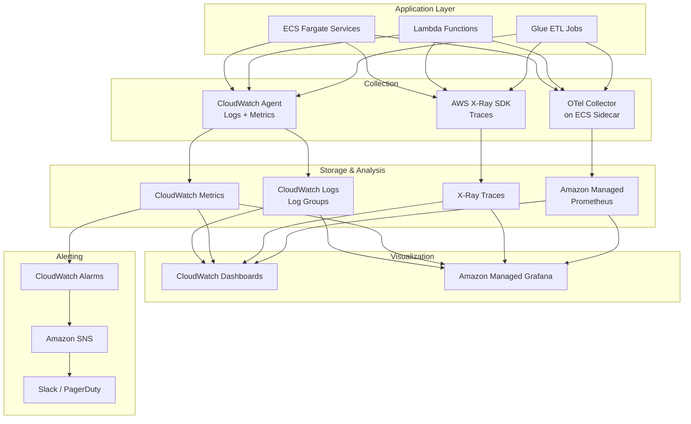

# Observability in System Design

Observability is the ability to understand the internal state of a system by examining its external outputs. Unlike traditional monitoring (which answers "Is the system up?"), observability answers "Why is the system behaving this way?" It is the foundation of operating reliable, production-grade AI and data engineering systems.

---

## 1. The Three Pillars of Observability

All observability tooling revolves around three signal types. A mature system collects and correlates all three.

### Logs
Timestamped, immutable records of discrete events within the system.
*   **Example:** `{"timestamp": "2026-04-17T18:00:00Z", "level": "ERROR", "service": "etl-worker", "message": "Schema mismatch on column 'revenue'", "table": "sales_fact"}`
*   **AWS:** Amazon CloudWatch Logs, Amazon OpenSearch.
*   **Key Practice:** Use **structured logging** (JSON) in production. Plain-text logs are human-readable but machine-unsearchable.

### Metrics
Numeric measurements aggregated over time intervals, representing system health and performance.
*   **Example:** `cpu_utilization_percent{instance="i-0abc123"} = 78.4` at `t=18:00:00`
*   **AWS:** Amazon CloudWatch Metrics, Amazon Managed Service for Prometheus.
*   **Key Practice:** Emit **custom business metrics** alongside infrastructure metrics. "Rows processed per minute" is more actionable than "CPU at 80%."

### Traces
Records that follow a single request or transaction as it traverses multiple services in a distributed system. A trace is composed of **spans**, where each span represents a unit of work (e.g., an API call, a database query, an LLM invocation).
*   **Example:** A user request hits API Gateway → Lambda → DynamoDB → Bedrock. Each hop is a span; the collection of spans is a trace.
*   **AWS:** AWS X-Ray, Amazon CloudWatch ServiceLens.
*   **Key Practice:** Propagate a **Trace ID** (correlation ID) through every service boundary via HTTP headers. This enables end-to-end tracing across microservices.

---

## 2. Key Terminology

### Telemetry
The automated process of collecting and transmitting data from remote systems to a central location for monitoring and analysis. Telemetry is the *mechanism*; observability is the *goal*. OpenTelemetry (OTel) is the industry-standard framework for instrumenting telemetry.

### APM (Application Performance Monitoring)
A category of tooling focused on monitoring the performance and availability of software applications. APM tools typically provide:
*   Transaction tracing (distributed traces)
*   Error tracking and grouping
*   Service dependency maps
*   Latency percentile analysis (p50, p95, p99)

**AWS:** Amazon CloudWatch Application Insights, AWS X-Ray.
**Third-Party:** Datadog APM, New Relic, Dynatrace.

### SLI, SLO, SLA

| Term | Definition | Example |
|------|-----------|---------|
| **SLI** (Service Level Indicator) | A quantitative measurement of a specific aspect of service quality. | "99.2% of API requests completed in < 200ms over the last 30 days." |
| **SLO** (Service Level Objective) | The target value or range for an SLI that the engineering team commits to. | "99.5% of API requests SHOULD complete in < 200ms." |
| **SLA** (Service Level Agreement) | A contractual commitment between a provider and a customer, with financial consequences for violations. | "We guarantee 99.9% uptime. If we fall below, you receive a 10% credit." |

**Relationship:** SLIs are measured → SLOs are targets set on SLIs → SLAs are contracts enforced on SLOs.

### Error Budget
The allowable amount of unreliability before an SLO is breached. If your SLO is 99.5% availability, your error budget is 0.5% (≈ 3.6 hours/month of downtime). When the error budget is exhausted, teams should freeze feature releases and prioritize reliability.

### MTTD, MTTR, MTBF

| Metric | Full Name | Meaning |
|--------|-----------|---------|
| **MTTD** | Mean Time to Detect | Average time from when an incident occurs to when it is detected. Improved by alerting. |
| **MTTR** | Mean Time to Resolve | Average time from detection to resolution. Improved by observability and runbooks. |
| **MTBF** | Mean Time Between Failures | Average time between consecutive failures. Improved by reliability engineering. |

### Golden Signals (Google SRE)
Four key metrics that Google's SRE team recommends monitoring for any service:

1.  **Latency:** The time it takes to serve a request. Distinguish between successful and failed request latency.
2.  **Traffic:** The volume of demand (requests per second, messages per second, rows ingested per minute).
3.  **Errors:** The rate of failed requests (HTTP 5xx, pipeline task failures, LLM API errors).
4.  **Saturation:** How "full" the system is (CPU %, memory %, queue depth, DPU utilization).

### RED Method
An alternative mnemonic for microservices monitoring:
*   **R**ate: Requests per second.
*   **E**rrors: Number of failed requests per second.
*   **D**uration: Histogram of request latencies.

### USE Method
A mnemonic for infrastructure/resource monitoring:
*   **U**tilization: Percentage of resource capacity being used.
*   **S**aturation: The degree to which work is queued (waiting).
*   **E**rrors: Count of error events.

---

## 3. Observability in Data Engineering

Data pipelines have unique observability requirements beyond standard web services:

### Data Quality Metrics
*   **Freshness:** How recent is the most recent record in a table? Alert if a table hasn't been updated in > 2 hours.
*   **Volume:** Are row counts within expected ranges? A table that usually receives 1M rows/day but only got 100K is a red flag.
*   **Schema Changes:** Did any column get added, removed, or change type since the last run?
*   **Null Rate:** What percentage of a critical column (e.g., `user_id`) is null? Alert if it exceeds a threshold.
*   **Distribution Drift:** Has the statistical distribution of a numeric column shifted significantly?

### Pipeline Execution Metrics
*   **DAG Duration:** Total wall-clock time for a DAG run. Set alerts for runs that exceed 2x the historical average.
*   **Task Success Rate:** Percentage of tasks that succeed on the first attempt. A declining success rate signals growing instability.
*   **SLA Misses:** Did the pipeline finish before the business SLA deadline (e.g., "dashboard data must be refreshed by 8 AM EST")?

### AWS Services for Data Observability
| Need | AWS Service |
|------|-------------|
| Pipeline logs | CloudWatch Logs (MWAA, Glue, Lambda) |
| Pipeline metrics | CloudWatch Metrics (custom: rows processed, duration) |
| Data quality rules | AWS Glue Data Quality |
| Schema monitoring | AWS Glue Data Catalog + EventBridge (schema change events) |
| Alerting | Amazon SNS + CloudWatch Alarms |
| Dashboards | Amazon CloudWatch Dashboards, Amazon Managed Grafana |

---

## 4. Observability in AI Systems

AI systems add another layer of complexity: non-deterministic LLM behavior, token cost tracking, and prompt quality monitoring.

### LLM-Specific Signals
*   **Token Usage:** Track `prompt_tokens`, `completion_tokens`, `total_tokens` per request. Emit as CloudWatch metrics for cost forecasting.
*   **Latency Breakdown:**
    *   Time to First Token (TTFT): How long until the LLM starts streaming.
    *   Inter-Token Latency (ITL): Delay between subsequent tokens.
    *   Total Generation Time: End-to-end time to produce the full response.
*   **Prompt/Response Logging:** Log the full prompt and response for debugging hallucinations and quality regressions. Use sampling (log 10% of requests) in high-volume production to manage storage costs.
*   **Hallucination Rate:** Track the percentage of responses that fail a factual grounding check (e.g., the answer contradicts the RAG context).
*   **Tool Call Success Rate:** In agentic systems, what percentage of tool calls succeed vs. fail or timeout?

### AWS/Open-Source Tools for AI Observability
| Tool | Purpose |
|------|---------|
| **LangSmith** | Full tracing for LangChain/LangGraph: every LLM call, tool call, and chain step. |
| **AWS X-Ray** | Distributed tracing across API Gateway → ECS → Bedrock. |
| **Amazon Bedrock Model Invocation Logging** | Logs all Bedrock API calls (prompts and responses) to S3 or CloudWatch. |
| **Arize AI / Phoenix** | Open-source LLM observability: embeddings drift, prompt/response quality. |
| **OpenTelemetry + Grafana** | Vendor-neutral telemetry collection with open-source dashboards. |

---

## 5. Alerting Best Practices

Alerting turns passive observability into active incident response.

### Alert Design Principles
1.  **Alert on Symptoms, Not Causes:** Alert on "API error rate > 5%" (symptom), not "CPU > 90%" (possible cause). High CPU may be perfectly normal during a batch job.
2.  **Use Multi-Window Alerting:** Avoid flapping alerts by requiring a condition to persist over multiple evaluation windows (e.g., "> 5% error rate for 5 consecutive minutes").
3.  **Severity Tiers:** Not every alert needs to page an on-call engineer at 3 AM.
    *   **P1 (Critical):** System down, data loss risk. Page immediately.
    *   **P2 (High):** Significant degradation, SLO at risk. Notify Slack, expect response within 1 hour.
    *   **P3 (Low):** Minor anomaly, no user impact. Create a ticket for next business day.
4.  **Include Runbook Links:** Every alert notification should include a link to a runbook that documents the investigation steps for that specific alert.

### AWS Alerting Architecture

---

## 6. Observability Architecture Pattern

A common production observability stack on AWS:

