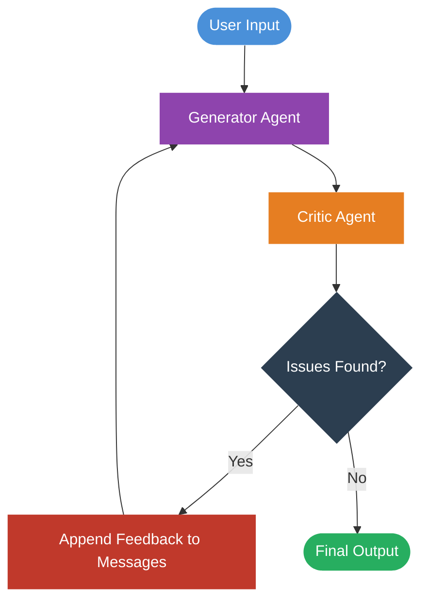
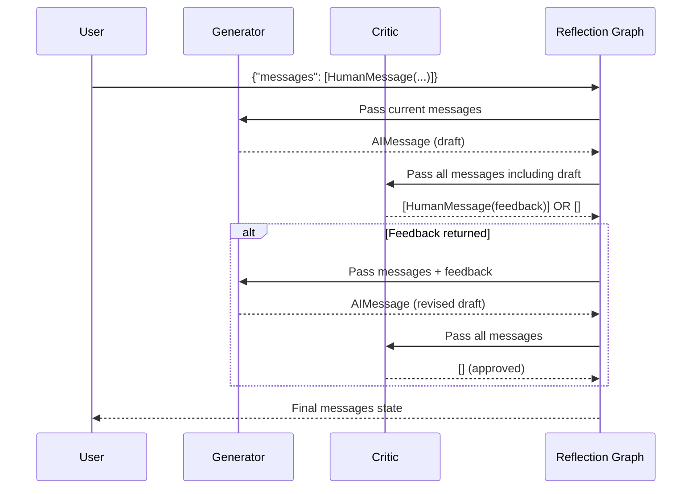
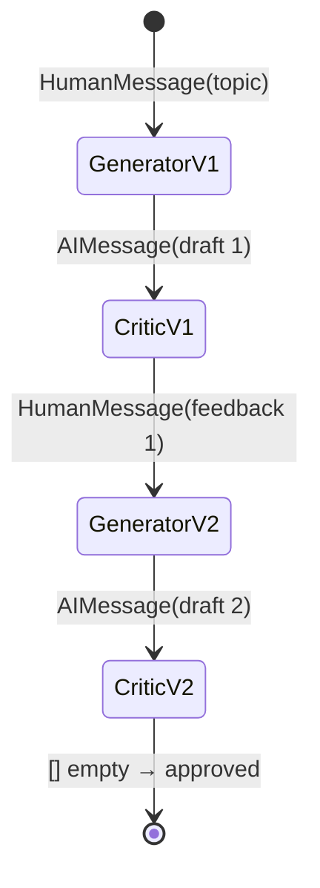

# Reflection Agents with LangGraph

## 1. Introduction

A **reflection agent** is an AI system that improves its own outputs through iterative self-critique. Instead of producing a single response and stopping, the agent generates a draft, evaluates it with a separate critique step, and refines the output based on that feedback — repeating until the result is satisfactory.

The `langgraph-reflection` library provides a prebuilt graph that wires this loop together so you can focus on writing the generator and critique logic, not the plumbing.

### What You'll Learn

- How the reflection loop works conceptually
- How to install and configure `langgraph-reflection`
- How to define a generator agent and a critique agent
- How to build and run a reflection graph end-to-end
- How to apply reflection to a practical task (essay writing)

### Prerequisites

- Python 3.11+
- Basic familiarity with LangChain and LangGraph
- An OpenAI API key

---

## 2. How Reflection Agents Work

At its core, a reflection agent is a two-agent system that cycles in a loop:

1. **Generator** — produces an initial response (or a revised one after feedback)
2. **Critic** — evaluates the generator's output and returns feedback, or nothing if the output is good enough

The loop terminates when the critic returns no new messages (approval) or a maximum iteration count is hit.



### Key Insight: Termination Signal

The critic signals completion by returning **an empty message list**. As long as it returns messages, the loop continues. This is the convention enforced by `langgraph-reflection`.

### Why Reflection Works

A single LLM call often produces "good enough" output. But separating generation from evaluation allows each role to be optimized independently — the critic can use a stricter prompt, different temperature settings, or even a different model than the generator. Research shows that iterative refinement improves output quality significantly on complex tasks.

---

## 3. Setup and Installation

### Create a Virtual Environment

```bash
conda create -n reflection_env python=3.11 -y
conda activate reflection_env
```

### Install Required Packages

```bash
pip install langgraph-reflection langchain-openai python-dotenv
```

### Environment Variables

Create a `.env` file in your project root:

```env
OPENAI_API_KEY=your_openai_api_key_here
```

### Project Structure

```
reflection-agent/
├── .env
├── requirements.txt
└── src/
    ├── generator.py
    ├── critic.py
    └── main.py
```

---

## 4. Core Concepts

### The `create_reflection_graph` Function

`langgraph-reflection` exposes a single factory function:

```python
from langgraph_reflection import create_reflection_graph
```

It accepts two compiled LangGraph graphs:

| Parameter        | Role                                                                 |
|------------------|----------------------------------------------------------------------|
| `assistant_graph` | The **generator** — takes messages, produces a draft response        |
| `critique_graph`  | The **critic** — takes messages, returns feedback or an empty list   |

Both graphs share the same message-based state. The reflection graph stitches them together into a loop automatically.

### Message Flow



### Iteration Limit

To prevent infinite loops, pass a `recursion_limit` in the config when invoking:

```python
result = graph.invoke(
    {"messages": [...]},
    config={"recursion_limit": 10}
)
```

A `recursion_limit` of 10 typically allows 3–4 full reflection cycles.

---

## 5. Building the Generator Agent

The generator is a standard LangGraph graph. It takes the current message history and appends a new AI response.

```python
# src/generator.py
from langchain_openai import ChatOpenAI
from langchain_core.messages import SystemMessage
from langgraph.graph import StateGraph, MessagesState, END
from dotenv import load_dotenv

load_dotenv()

GENERATOR_SYSTEM_PROMPT = """You are an expert essay writer.
Write clear, well-structured, and engaging essays based on the user's topic.
When given feedback, incorporate it into a revised version of your essay."""

llm = ChatOpenAI(model="gpt-4o", temperature=0.7)


def generate(state: MessagesState):
    """Generate or revise an essay based on the current message history."""
    messages = [SystemMessage(content=GENERATOR_SYSTEM_PROMPT)] + state["messages"]
    response = llm.invoke(messages)
    return {"messages": [response]}


def build_generator():
    graph = StateGraph(MessagesState)
    graph.add_node("generate", generate)
    graph.set_entry_point("generate")
    graph.add_edge("generate", END)
    return graph.compile()
```

---

## 6. Building the Critic Agent

The critic evaluates the generator's latest output. The critical convention: **return an empty list to approve**, or return a `HumanMessage` with structured feedback to trigger another revision.

```python
# src/critic.py
from langchain_openai import ChatOpenAI
from langchain_core.messages import SystemMessage, HumanMessage, AIMessage
from langgraph.graph import StateGraph, MessagesState, END
from dotenv import load_dotenv

load_dotenv()

CRITIC_SYSTEM_PROMPT = """You are a strict essay editor. Review the essay and evaluate it on:
- Clarity and coherence
- Strength of argument
- Use of evidence or examples
- Grammar and style

If the essay meets a high standard on all criteria, respond with exactly: APPROVED
If it needs improvement, respond with specific, actionable feedback starting with: FEEDBACK:"""

llm = ChatOpenAI(model="gpt-4o", temperature=0)


def critique(state: MessagesState):
    """Critique the latest essay draft."""
    messages = [SystemMessage(content=CRITIC_SYSTEM_PROMPT)] + state["messages"]
    response = llm.invoke(messages)

    critique_text = response.content.strip()

    # Signal completion by returning no new messages
    if critique_text.upper().startswith("APPROVED"):
        return {"messages": []}

    # Return feedback as a HumanMessage so the generator sees it as a new instruction
    return {"messages": [HumanMessage(content=critique_text)]}


def build_critic():
    graph = StateGraph(MessagesState)
    graph.add_node("critique", critique)
    graph.set_entry_point("critique")
    graph.add_edge("critique", END)
    return graph.compile()
```

---

## 7. Assembling the Reflection Graph

With the generator and critic ready, pass them to `create_reflection_graph`:

```python
# src/main.py
from langchain_core.messages import HumanMessage
from langgraph_reflection import create_reflection_graph
from generator import build_generator
from critic import build_critic


def main():
    generator = build_generator()
    critic = build_critic()

    # Wire them together into a reflection loop
    reflection_graph = create_reflection_graph(
        assistant_graph=generator,
        critique_graph=critic,
    )

    topic = "The long-term societal impact of large language models"

    result = reflection_graph.invoke(
        {"messages": [HumanMessage(content=f"Write a 3-paragraph essay on: {topic}")]},
        config={"recursion_limit": 10},
    )

    # The final AI response is the last AIMessage in the message list
    final_essay = next(
        msg.content
        for msg in reversed(result["messages"])
        if isinstance(msg, __import__("langchain_core.messages", fromlist=["AIMessage"]).AIMessage)
    )

    print("=== Final Essay ===")
    print(final_essay)


if __name__ == "__main__":
    main()
```

---

## 8. Full Lifecycle Diagram

The diagram below shows the complete message state after two reflection cycles before approval:



Each cycle appends to the shared message list, giving the generator full context of the original request, its previous drafts, and all prior feedback.

---

## 9. Inspecting the Reflection Loop

To observe each step of the loop as it executes, use `.stream()` instead of `.invoke()`:

```python
def stream_reflection(topic: str):
    from langchain_core.messages import HumanMessage, AIMessage
    from langgraph_reflection import create_reflection_graph
    from generator import build_generator
    from critic import build_critic

    reflection_graph = create_reflection_graph(
        assistant_graph=build_generator(),
        critique_graph=build_critic(),
    )

    inputs = {"messages": [HumanMessage(content=f"Write a 3-paragraph essay on: {topic}")]}

    print("=== Reflection Loop ===\n")
    for step, state in enumerate(reflection_graph.stream(inputs, config={"recursion_limit": 10})):
        for node_name, update in state.items():
            if not update.get("messages"):
                print(f"[Step {step}] {node_name}: Critic approved — stopping.\n")
                continue
            for msg in update["messages"]:
                role = "Generator" if isinstance(msg, AIMessage) else "Critic"
                print(f"[Step {step}] {role} ({node_name}):")
                print(msg.content[:300] + ("..." if len(msg.content) > 300 else ""))
                print()
```

---

## 10. Varying the LLM per Role

You can use different models for generation vs. critique. A cheaper, faster model for generation and a more capable model for critique is a common production pattern:

```python
# In generator.py
generator_llm = ChatOpenAI(model="gpt-4o-mini", temperature=0.7)

# In critic.py
critic_llm = ChatOpenAI(model="gpt-4o", temperature=0)
```

This trades some generation quality for speed and cost, while keeping evaluation rigorous.

---

## 11. Complete Working Example

Here is a self-contained script combining all components:

```python
# reflection_essay.py
import os
from dotenv import load_dotenv
from langchain_openai import ChatOpenAI
from langchain_core.messages import SystemMessage, HumanMessage, AIMessage
from langgraph.graph import StateGraph, MessagesState, END
from langgraph_reflection import create_reflection_graph

load_dotenv()

# ── LLMs ──────────────────────────────────────────────────────────────────────
generator_llm = ChatOpenAI(model="gpt-4o-mini", temperature=0.7)
critic_llm = ChatOpenAI(model="gpt-4o", temperature=0)

# ── Generator ─────────────────────────────────────────────────────────────────
GENERATOR_PROMPT = """You are an expert essay writer.
Write clear, well-structured, engaging essays.
When given feedback, produce a fully revised version."""

def generate(state: MessagesState):
    messages = [SystemMessage(content=GENERATOR_PROMPT)] + state["messages"]
    return {"messages": [generator_llm.invoke(messages)]}

generator_graph = StateGraph(MessagesState)
generator_graph.add_node("generate", generate)
generator_graph.set_entry_point("generate")
generator_graph.add_edge("generate", END)
generator = generator_graph.compile()

# ── Critic ────────────────────────────────────────────────────────────────────
CRITIC_PROMPT = """You are a strict essay editor. Evaluate on:
- Clarity and coherence
- Strength of argument
- Use of examples
- Grammar and style

If all criteria are met, respond with exactly: APPROVED
Otherwise, respond with: FEEDBACK: <specific suggestions>"""

def critique(state: MessagesState):
    messages = [SystemMessage(content=CRITIC_PROMPT)] + state["messages"]
    response = critic_llm.invoke(messages)
    text = response.content.strip()

    if text.upper().startswith("APPROVED"):
        return {"messages": []}  # Empty list signals approval

    return {"messages": [HumanMessage(content=text)]}

critic_graph = StateGraph(MessagesState)
critic_graph.add_node("critique", critique)
critic_graph.set_entry_point("critique")
critic_graph.add_edge("critique", END)
critic = critic_graph.compile()

# ── Reflection Graph ───────────────────────────────────────────────────────────
reflection = create_reflection_graph(
    assistant_graph=generator,
    critique_graph=critic,
)

# ── Run ────────────────────────────────────────────────────────────────────────
if __name__ == "__main__":
    topic = "Why open-source AI models matter for society"

    print(f"Topic: {topic}\n")
    print("Running reflection loop...\n")

    result = reflection.invoke(
        {"messages": [HumanMessage(content=f"Write a 3-paragraph essay on: {topic}")]},
        config={"recursion_limit": 10},
    )

    # Extract final essay (last AIMessage)
    final = next(
        m.content for m in reversed(result["messages"]) if isinstance(m, AIMessage)
    )

    # Count reflection cycles (each cycle adds one feedback HumanMessage)
    cycles = sum(
        1 for m in result["messages"]
        if isinstance(m, HumanMessage) and "FEEDBACK" in m.content
    )

    print(f"Completed in {cycles} reflection cycle(s).\n")
    print("=== Final Essay ===")
    print(final)
```

Run with:

```bash
python reflection_essay.py
```

---

## 12. Summary

| Concept | Description |
|---|---|
| `create_reflection_graph` | Factory that wires a generator and critic into a loop |
| Generator graph | Produces or revises output based on current message history |
| Critic graph | Returns feedback messages, or an empty list to approve |
| Termination | Empty list from critic, or `recursion_limit` reached |
| Message state | Fully shared — both agents see the entire conversation history |
| Model flexibility | Generator and critic can use different models or temperatures |

### Next Steps

- Add **structured critique output** using Pydantic models and `.with_structured_output()` for more reliable parsing
- Apply reflection to **code generation** — use Pyright or `ast.parse` in the critic for syntax validation
- Integrate **LangSmith** tracing to visualize each reflection cycle in detail
- Experiment with **multi-turn reflection** where the critic has multiple specialized sub-checks (factuality, tone, length)

### Resources

- [langgraph-reflection on PyPI](https://pypi.org/project/langgraph-reflection/)
- [langgraph-reflection GitHub](https://github.com/langchain-ai/langgraph-reflection)